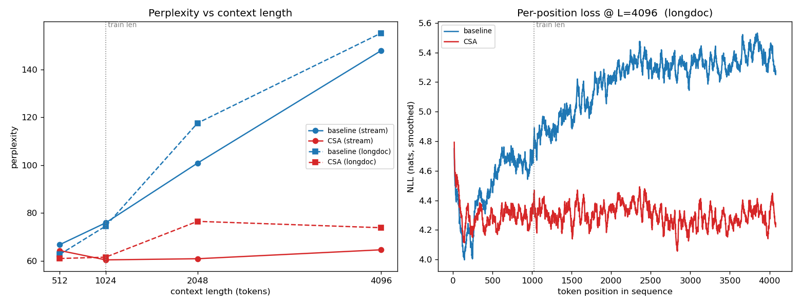

# Experiment: CSA vs. standard attention — 125M, 200M tokens

**Date:** 2026-06-08 → 2026-06-09 · **Updated:** 2026-06-10 (fair re-evaluation + long-context sweep)
**Question:** Does a 125M model with DeepSeek-V4 **Compressed Sparse Attention (CSA)**
in *every* layer match or beat the same model with standard causal attention —
and how do the two behave when you push context **past the training length**?

**TL;DR (revised 2026-06-10):**
- During training, the recorded best val loss favored the baseline (**3.936** vs CSA
  **4.075**). That number does **not survive a fair re-evaluation.** The stored
  `best_val_loss` is each run's *luckiest* eval window; on a full unbiased pass over
  the same val set the **baseline scores ppl ≈ 71 and CSA ≈ 57** — CSA is *better* at
  the training length. (The baseline's 3.936 is not reproducible from its saved
  weights; see §4.)
- **Length generalization is the real story: CSA wins decisively.** Zero-shot
  perplexity at 0.5×/1×/2×/4× the training length — baseline ppl ~doubles (76→148),
  **CSA stays flat (60→65)**. Per-token loss on fixed 4096-token documents is *flat*
  for CSA and *rising* for the baseline. See §5.
- The baseline still wins on **throughput** (~1.9×): our CSA is the dense research
  kernel with no FLOP advantage.

So the original "standard attention won on quality" conclusion was an evaluation
artifact. Corrected: **CSA wins on quality (fair eval) and on length-robustness; the
baseline wins on speed.**

---

## 1. Setup

| | Value |
|---|---|
| Model | GPT-2-style, 12 layers, 12 heads, n_embd 768, block 1024 |
| Modern bits | RMSNorm, RoPE, SwiGLU, no bias, dropout 0 |
| Params | baseline **123.6M**, CSA **115.8M** |
| Data | OpenWebText (parquet, on-the-fly GPT-2 tokenization), held-out val = last shard |
| Tokens | ~200M each (8 batch × 16 grad-accum × 1024 × **1525 iters** = 199.8M) |
| Optimizer | AdamW, lr 6e-4 cosine → 6e-5, warmup 80, wd 0.1, grad-clip 1.0, β=(0.9, 0.95) |
| Precision | bf16 autocast + `torch.compile` |
| Hardware | 1× RTX 3090 Ti (24 GB, Ampere) |
| Configs | `configs/csa_125m.yaml`, `configs/baseline_125m.yaml` (identical except attention) |

The two configs differ **only** in the attention: `use_csa: true` vs `false`.

### CSA hyperparameters (all layers)
`compress_ratio m=4`, `top_k=64` (of 256 compressed blocks), `window=128`,
`q_compress_dim=256`, output groups `g=4`, indexer `n_idx_head=8`,
`idx_head_dim=64`, `rope_head_dim=32`, indexer-distillation aux-loss weight `0.01`.
The indexer's top-k is non-differentiable, so it is trained by the auxiliary
distillation loss threaded through `Block → total_aux_loss`.

---

## 2. Feasibility / throughput (why the budget is 200M, not 1B)

Measured at the real 125M / block-1024 scale before committing:

| Config | tok/s | peak mem | ETA for 1B tokens |
|---|---|---|---|
| Baseline, eager | 42,000 | 10.4 GB | 6.6 h |
| Baseline, **compiled** | 55,300 | 7.6 GB | 5.0 h |
| CSA, eager | 4,433 | 22.6 GB | 62.7 h |
| CSA, compiled (after RoPE-buffer fix) | 26,325 | 19.1 GB | 10.5 h |

Two things this surfaced:
1. **CSA is much heavier**, because the dense research kernel computes a full `T×T`
   window softmax *plus* the compressed + indexer branches (no gather/Triton kernel).
2. A **`torch.compile` recompile-thrash bug**: `int(pos.max().item())` in the RoPE
   frequency sizing caused graph breaks + cache invalidation. Fixed by precomputing
   the RoPE rotation table as a buffer and indexing it (also how the reference does
   it) → 21K → **26K tok/s**, 0 recompile warnings.

1B tokens each would have been ~18 h; we ran **200M each** (~3.5 h total) for a first
signal. In-training throughput came out a bit lower than the isolated bench because
the indexer aux-loss recomputes the compressed/indexer path each layer:

| | best val | final val | train loss | tok/s (in-train) | s/iter | peak mem |
|---|---|---|---|---|---|---|
| Baseline | **3.936**\* | 3.947 | 3.894 | 46,600 | 2.81 | 10.3 GB |
| CSA | 4.075 | 4.093 | 4.030 | 24,000 | 5.45 | 23.2 GB |

\* Not reproducible on a fair re-eval — see §4. Throughput conclusion stands.
Wall-clock: CSA ≈ 2.3 h, baseline ≈ 1.2 h (sequential, one GPU).

---

## 3. Training-run validation curve (as recorded)

Val loss every 100 steps (lower is better), as logged during the two runs:

| step | tokens (M) | CSA | Baseline | Δ (Base − CSA) |
|---:|---:|---:|---:|---:|
| 0 | 0.0 | 10.942 | 10.969 | +0.027 |
| 100 | 13.1 | 6.150 | 5.942 | −0.208 |
| 300 | 39.3 | 5.108 | 4.985 | −0.123 |
| 500 | 65.5 | 4.746 | 4.642 | −0.104 |
| 700 | 91.8 | 4.517 | 4.399 | −0.117 |
| 900 | 118.0 | 4.336 | 4.213 | −0.123 |
| 1100 | 144.2 | 4.181 | 4.043 | −0.137 |
| 1300 | 170.4 | 4.177 | 4.038 | −0.139 |
| 1400 | 183.5 | 4.075 | 3.936 | −0.140 |
| 1500 | 196.6 | 4.093 | 3.947 | −0.145 |

As *recorded*, the baseline leads by ~0.10–0.15 the whole run. **But these are
single-eval-window numbers** (`always_save_checkpoint: false` keeps the min over a
40-batch window), and §4 shows the baseline's window was anomalously easy. Plot:
`out-125m-comparison.png`.

---

## 4. Fair re-evaluation at the training length (the correction)

We re-evaluated both *final* checkpoints on the OpenWebText val set with one harness,
recomputing cross-entropy from logits (CSA's indexer aux loss excluded), under two
independent protocols: (A) the model's native best-fit packing loader, and (B) a
deterministic non-overlapping stream over the whole val set.

| | packing (full pass) | stream (all 4330 windows) |
|---|---|---|
| **baseline** | nll 4.289 · ppl **72.9** | nll 4.388 · ppl **80.5** |
| **CSA** | nll 4.053 · ppl **57.6** | nll 4.157 · ppl **63.9** |

Both protocols agree: **CSA is better at the 1024 training length.** Two checks
confirm the baseline checkpoint is healthy, not mis-loaded:

- **Reproducibility.** A 40-batch rolling window over the full val set gives, for the
  baseline, min **4.239** / mean 4.294 / max 4.335 — it **never approaches the stored
  3.936**. CSA's rolling window is 4.011–4.099, and its stored best (4.075) sits
  inside it. So CSA's recorded number is real; the baseline's is not reproducible
  from its saved weights.
- **Coherence.** The baseline generates fluent (if weak — 125M / 200M tokens) English,
  so the weights are genuine trained weights, just not the ones that scored 3.936.

Most likely the baseline's train-time 3.936 came from a different data/eval state
(these runs were launched on remote GPU boxes). **Re-run the baseline train-eval
before citing 3.936 anywhere.** The fair-eval ranking (CSA ahead) is what holds.

---

## 5. Long context — the headline result

Neither model was trained beyond 1024 tokens, so this is **zero-shot length
extrapolation**: we feed contiguous OWT-val text at 0.5×/1×/2×/4× the training length
and measure perplexity. (Built by rebuilding each model at the extended `block_size`;
CSA's RoPE table is `persistent=False` so it is reconstructed at the target length,
and the baseline's flash-SDPA path needs no fixed mask buffer.)

**Perplexity vs. context length** (stream protocol, 128 windows per length):

| context | × train len | baseline ppl | CSA ppl | Δ |
|---|---|---|---|---|
| 512  | 0.5× | 66.7  | 64.3 | −2.4 |
| 1024 | 1×   | 75.8  | **60.4** | −15.4 |
| 2048 | 2×   | 100.8 | **60.8** | −40.0 |
| 4096 | 4×   | 147.9 | **64.6** | −83.3 |

Inflation relative to the 1024 training length: baseline **1.95×** by 4×, CSA
**1.07×**. The coherent-long-document protocol agrees (baseline 74.5→117.5→155.2,
CSA 61.5→76.5→73.8 over 1×→2×→4×).



**Left:** baseline (blue) climbs almost linearly with context; CSA (red) is flat.
Stream (solid) and long-doc (dashed) protocols agree.

**Right — the cleanest signal:** per-position NLL at L=4096, averaged over the *same*
96 documents for both models (no sampling confound). The baseline's loss rises
monotonically from ~4.5 to ~5.4 nats with position — it predicts **worse** the more
context it is given, and the rise continues past the 1024 boundary (dotted line). CSA
is **dead flat at ~4.3** across all 4096 positions. The two curves nearly touch in the
first ~150 tokens (the baseline even dips slightly lower), which is why the 512 point
is close — the baseline only falls apart once real long-range context accumulates.

**Why CSA holds up:** it never asks the model to extrapolate dense RoPE over thousands
of unseen absolute positions. Local detail goes through a 128-token sliding window;
distant context is summarized into compressed blocks whose RoPE positions sit at
strided block-starts (`i·m`), and queries see only `top_k` of them. The effective
positional range and the number of attended keys stay bounded, so behavior at 4096
looks like behavior at 1024. Dense attention applies full-resolution RoPE across
0…4095 and attends to everything — exactly the regime it was never trained on.

---

## 6. Interpretation

1. **At the training length, CSA is the better model here** (fair eval, ppl ~57 vs
   ~71), despite ~8M fewer params. The original "baseline wins quality" was an
   eval-window artifact (§4).
2. **CSA's architectural priors generalize in length almost for free.** This is the
   mechanism it was designed for, now actually exercised: flat per-position loss out
   to 4× with zero long-context training.
3. **The baseline's failure is the textbook RoPE-extrapolation collapse**, plus an
   inability to exploit even mid-range (≤1024) context — its per-token loss rises with
   position throughout.
4. **The baseline still wins throughput** (~1.9×): the dense research CSA has no FLOP
   upside. Closing that needs the gather/Triton kernel (§8).

---

## 7. Caveats / what this does NOT show

- **Single seed, single 200M-token run each** — no error bars; 200M tokens is far from
  convergence.
- **Zero-shot length extrapolation**, not *trained* long context — neither model saw
  >1024 tokens. CSA's flatness is generalization, not learned long-range modeling.
- ppl-vs-length absolute points carry a mild sampling/doc-set confound (different
  windows/documents per length); the **per-position curve at fixed 4096** (§5, right)
  is the confound-free comparison and tells the same story.
- This is the **dense, numerically-faithful research CSA**, not the production
  FP8/FP4 + Triton `sparse_attn` kernel. Faithfulness audited in
  [REFERENCE_AUDIT.md](REFERENCE_AUDIT.md).
- **All-CSA in every layer**, not DeepSeek-V4's CSA/HCA interleave with a full final
  attention layer.
- The baseline's train-time 3.936 is unexplained (§4).

---

## 8. Artifacts

| What | Path |
|---|---|
| CSA / baseline configs | `configs/csa_125m.yaml`, `configs/baseline_125m.yaml` |
| Checkpoints + metrics | `out-125m-{csa,baseline}/ckpt_*.pt`, `.../metrics.json` |
| Training-curve plot | `out-125m-comparison.png` |
| **Long-context eval harness** | `experiments/csa_hca/eval_long_context.py` |
| **Long-context results (JSON)** | `experiments/csa_hca/long_context_results.json` |
| **Long-context figure** | `experiments/csa_hca/long_context_ppl.png` |
| CSA model integration | `models/gpt.py` (`use_csa`, `CSABlockAttention`) + `utils/config.py` (`csa_*`) |
| CSA implementation | `experiments/csa_hca/` (csa.py, hca.py, common.py) |

(`out-*/`, `*.pt`, `*.png`, `*.json` are gitignored; configs and code are tracked.)

---

## 9. Reproduce

```bash
# Train (each writes metrics.json + TensorBoard to its out_dir)
python train.py configs/csa_125m.yaml          # CSA, all layers, ~200M tokens
python train.py configs/baseline_125m.yaml     # standard attention, identical otherwise

# Fair re-eval + long-context sweep (0.5×/1×/2×/4×); writes JSON + figure
python experiments/csa_hca/eval_long_context.py \
    --lengths 512 1024 2048 4096 --max_windows 128 --max_docs 96 --batch 8
# NOTE: use --batch 8 → B=2 at T=4096; B=4 hits the 24GB ceiling and thrashes.
```

Token budget scales with `max_iters`: tokens ≈ `batch × grad_accum × block × iters`
= 131,072 × iters.

---

## 10. Suggested next experiments

1. **Push further — 8×/16× context (8192/16384).** CSA hasn't shown its breaking point;
   find where (if) the flat curve finally bends.
2. **Re-run the baseline train-eval** to settle the 3.936 discrepancy (§4).
3. **Hybrid CSA/HCA interleave** (the real V4 stack) instead of all-CSA.
4. **Wire CSA to a gather/flash kernel** so its efficiency claim — the whole point of
   the architecture — can be measured, not just its quality.
5. **Train *at* long context** and re-test: does explicit long-context training widen
   CSA's lead, or does the baseline recover with trained RoPE?
