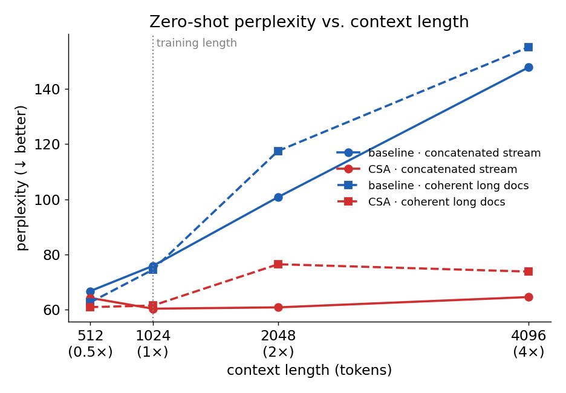
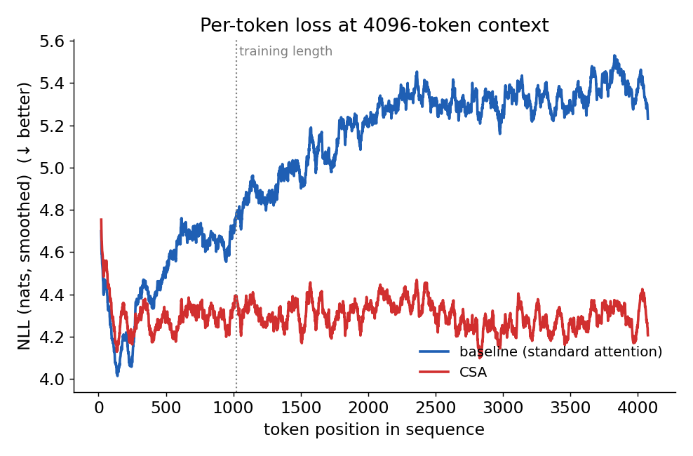

# The Benchmark Said Standard Attention Won. The Benchmark Was Wrong.

DeepSeek-V4 ships an attention variant called **Compressed Sparse Attention (CSA)**:
instead of letting every query attend to every key, it keeps a short sliding window
for local detail, compresses the distant past into a handful of summary blocks, and
uses a tiny "lightning indexer" to pick the few blocks worth reading. The pitch is
efficiency at long context — fewer keys, smaller KV cache, sub-quadratic cost.

We wanted to know something simpler first: **is it any good?** So we trained two
125M-parameter models that are byte-for-byte identical except for one thing — one uses
standard causal attention, the other uses CSA in every layer — and pointed them at
200M tokens of OpenWebText.

The validation loss came back clean and unambiguous. Standard attention won by ~0.14
nats, start to finish. We almost wrote it up as "sparse attention loses at small
scale, as expected" and moved on.

We're glad we didn't. Because that number was lying, and the real result — the one
hiding two context-lengths away — is the opposite.

---

## The setup: two models, one difference

Both models are vanilla-modern GPTs: 12 layers, 12 heads, `d_model` 768, RMSNorm,
RoPE, SwiGLU, no biases. Both train on the same OpenWebText shards, same AdamW
schedule (lr 6e-4, cosine), same 200M-token budget, same single RTX 3090 Ti. The
*only* difference is the attention module:

- **Baseline:** standard full causal attention.
- **CSA:** DeepSeek-V4 Compressed Sparse Attention in all 12 layers — a 128-token
  sliding window, compression ratio `m=4`, top-`k`=64 of 256 compressed blocks, and an
  indexer trained by an auxiliary distillation loss (its top-`k` selection is
  non-differentiable, so it learns to mimic the dense attention distribution).

CSA is actually a touch *smaller* (115.8M vs 123.6M params) because the compression
and grouped output projection shrink the parameter count. It is also, in our
implementation, much *slower* — this is the dense, numerically-faithful research port
of the kernel, not the production FP8 gather kernel, so it pays full `T×T` cost plus
the compression and indexer overhead. About 1.9× slower per step. Hold that thought;
it's the one part of the story that doesn't flip.

---

## The benchmark result (the one we didn't trust)

Here's what training logged, every 100 steps:

| tokens (M) | CSA val | Baseline val | Δ (Base − CSA) |
|---:|---:|---:|---:|
| 13  | 6.150 | 5.942 | −0.208 |
| 65  | 4.746 | 4.642 | −0.104 |
| 118 | 4.336 | 4.213 | −0.123 |
| 170 | 4.177 | 4.038 | −0.139 |
| 197 | 4.093 | 3.947 | −0.145 |

Best val loss: **baseline 3.936, CSA 4.075.** The gap opens in the first few thousand
steps and stays almost perfectly constant for the rest of the run. As clean a "the
baseline is just better" signal as you could ask for.

Two things nagged at us. First, CSA is *designed* for long context, and we were
testing it at block size 1024 — the regime where it has the least to offer. A constant
0.14-nat penalty at short context is plausible, but it's also exactly what you'd see if
compression were simply throwing away information the model could otherwise use. We
couldn't tell those apart from one number.

Second — and this is the thread we pulled — that 3.936 was a *single eval window*. Our
training script keeps the best checkpoint by minimum validation loss, where each
"validation loss" is the mean over a 40-batch slice of the val stream. We had a best
checkpoint and a best *number*. We did not have a guarantee that the number was
representative.

So before declaring a winner, we did the boring, essential thing: **we re-evaluated
both final checkpoints from scratch, on the whole validation set, with one harness.**

---

## Result 1: the validation loss that wouldn't reproduce

We loaded each final checkpoint and computed perplexity two independent ways — once
through the model's native best-fit packing loader (exactly how training measured it),
and once as a deterministic non-overlapping sweep over the *entire* val set. We
recomputed cross-entropy straight from the logits, with CSA's auxiliary indexer loss
excluded so we were comparing language-modeling quality and nothing else.

| | packing (full pass) | stream (all 4,330 windows) |
|---|---|---|
| **Baseline** | nll 4.289 · ppl **72.9** | nll 4.388 · ppl **80.5** |
| **CSA** | nll 4.053 · ppl **57.6** | nll 4.157 · ppl **63.9** |

Both protocols agree, and they tell the opposite story from the leaderboard:
**at the training length, CSA is the better model — by about 25% perplexity.**

The CSA side checks out against training: its recorded best (4.075 nats) lands right in
the middle of the rolling distribution we measured (min 4.011, mean 4.059, max 4.099).
CSA's benchmark number was honest.

The baseline's was not. We slid a 40-batch window across the whole validation set and
recorded the loss at every position. The baseline's *easiest* window anywhere in the
val set is **4.239**. Its mean is 4.294. It never once dips near the 3.936 stored in
its own checkpoint:

> Baseline rolling-window val loss — min **4.239**, mean 4.294, max 4.335.
> Stored "best": **3.936**. That window does not exist in our data.

This is not a lucky-draw story. A 0.30-nat gap between the recorded best and the
*minimum achievable* window can't be explained by eval variance — the easiest slice we
can find is still nowhere close. The saved weights simply do not produce 3.936 on this
validation set.

Before blaming the model, we ruled out the obvious failure mode: a corrupted or
mis-loaded checkpoint. We had the baseline generate text. It produces fluent,
grammatical English — weak and a little repetitive, as a 125M model trained on 200M
tokens should be, but unmistakably a working language model. The weights are real
trained weights. They're just not the weights that ever scored 3.936.

Our best guess is mundane: these runs were launched on remote GPU boxes, and the
baseline's train-time validation was measured against a slightly different data or
loader state than the one we re-evaluate against locally. The lesson generalizes past
this one bug, though: **a "best val loss" pulled from a single eval window is a
liability.** If you're going to rank two architectures on a 0.14-nat difference, that
difference had better survive a full, fair pass. Ours didn't — it inverted.

So with the scoreboard corrected, CSA is ahead at the training length. Now for the
question we actually cared about.

---

## The actual question: what happens past the training length?

Neither model has ever seen a sequence longer than 1024 tokens. RoPE — the rotary
positional encoding both models use — was only ever rotated through positions 0…1023.
What happens when we ask for more?

This is **zero-shot length extrapolation**, and it's the one test where CSA's design
should matter. We took contiguous OpenWebText validation text and measured perplexity
at four context lengths: 512, 1024, 2048, 4096 — that is, 0.5×, 1×, 2×, and 4× the
training length. Same harness, same data, both models, no fine-tuning. We just rebuild
each model at the longer block size and run.

(One implementation note for anyone reproducing this: CSA precomputes its RoPE rotation
table as a non-persistent buffer sized to the block length, so you have to rebuild the
model *at* the target length for the table to cover it. The baseline's flash-attention
path takes `is_causal=True` and needs no fixed mask buffer, so it extends for free. And
at 4096, keep the batch small — the float logits alone are 3.3 GB at batch 4, which
walks straight into the 24 GB ceiling.)

---

## Result 2: one curve goes flat, the other falls apart

| context | × train len | Baseline ppl | CSA ppl |
|---:|:---:|---:|---:|
| 512  | 0.5× | 66.7  | 64.3 |
| 1024 | 1×   | 75.8  | **60.4** |
| 2048 | 2×   | 100.8 | **60.8** |
| 4096 | 4×   | 147.9 | **64.6** |

Read down the columns. The baseline's perplexity nearly **doubles** from 1× to 4×
(75.8 → 147.9, a factor of 1.95). CSA's barely moves (60.4 → 64.6, a factor of 1.07).
By 4× context the gap is enormous: **148 vs 65 perplexity.**

The figure is the whole story in one line each: the baseline (blue) climbs almost
linearly with context, while CSA (red) is essentially flat. We ran a second, stricter
protocol too — take only documents that are genuinely 4096+ tokens long and evaluate on
coherent, single-document context (dashed) rather than a concatenated stream (solid) —
and it agrees: baseline 74.5 → 117.5 → 155.2 across 1× → 2× → 4×, CSA 61.5 → 76.5 → 73.8.

This is exactly the result CSA is supposed to produce, and the first time in this
project we'd actually put it in the regime it was built for. But the aggregate
perplexity still hides a confound — different context lengths sample slightly different
text. So we went one level deeper.

---

## Result 3: where, exactly, the baseline breaks

Aggregate perplexity averages over every position in the window. If you instead look at
the loss **as a function of position in the sequence**, you can see precisely where
each model succeeds and fails. We took a fixed set of 96 long documents, fed the first
4096 tokens of each to both models, and plotted the mean per-token loss at every
position. Same tokens, same positions, both models — no confound left.

This is the cleanest figure in the study:

- The **baseline** starts fine — for the first ~150 tokens it's actually a hair *better*
  than CSA — and then its loss climbs monotonically, ~4.5 nats early to ~5.4 nats by
  position 4000. It predicts **worse the more context it is given.** The rise doesn't
  even wait for the 1024 boundary; it's degrading throughout, and just keeps going once
  RoPE leaves the trained range entirely.
- **CSA** is **flat.** ~4.3 nats at position 500, ~4.3 nats at position 4000. Whatever
  it's doing at token 4000 looks identical to what it does at token 500.

That early crossover is why the 512-token perplexities are nearly tied: when there's
barely any context to use, dense attention is fine. The baseline only collapses once
real long-range context accumulates — which is to say, once you actually need
long-context modeling, which is the only time anyone reaches for it.

---

## Why CSA stays flat (the resolution)

It would be easy to call this "sparse attention is just more robust" and stop. But the
mechanism is specific, and it's worth naming, because it explains why CSA generalizes
in length *for free* while dense attention can't.

Dense attention at position 4000 does two things it was never trained to do at once. It
applies full-resolution RoPE to absolute positions 1024…4095 — rotations the model has
never seen — and it spreads a softmax over 4000 keys when it only ever learned to
allocate attention over ~1000. Both are out-of-distribution, and they compound.

CSA never enters either regime:

1. **Local detail goes through a fixed 128-token sliding window.** That window looks the
   same at position 4000 as at position 200 — the relative geometry the model trained on
   is preserved exactly.
2. **Distant context is compressed**, so a 4096-token history becomes ~1000 summary
   blocks, and RoPE is applied to those blocks at *strided* positions (`i·m`), not at
   raw token positions. The positional range the rotation actually has to span stays
   compressed.
3. **The query reads only `top_k` blocks**, so the number of keys in the softmax stays
   bounded regardless of how long the context gets. No softmax dilution.

In other words, the things that break dense attention at 4× context — unseen RoPE
positions and an unbounded key set — are precisely the things CSA's architecture holds
fixed. The model at 4096 is, mechanically, doing the same bounded computation it did at
1024. So it behaves the same. The flat red line isn't robustness; it's the direct
consequence of the design.

---

## What this does and doesn't mean

A few honest fences around the result:

- **This is zero-shot extrapolation, not trained long context.** Neither model was
  trained past 1024. CSA's flat curve is *generalization* — it's not modeling
  4000-token dependencies it learned, it's just not breaking. Train both at long
  context and the comparison could shift (our bet: it widens CSA's lead, but that's a
  bet, not a result).
- **Single seed, single 200M-token run each.** No error bars, far from convergence.
- **CSA is still ~1.9× slower here.** This is the dense research kernel; it has no FLOP
  advantage. The efficiency half of CSA's pitch — the whole reason the architecture
  exists — needs the real gather/Triton kernel before we can even measure it. We tested
  quality and length-robustness, not speed.
- **All-CSA isn't DeepSeek's actual design.** The real V4 stack *interleaves* CSA with a
  heavier "HCA" variant and keeps a full-attention final layer. CSA in every layer is
  the harshest possible setting for it — and it still won the long-context test.

---

## Takeaways

1. **Re-evaluate before you rank.** A 0.14-nat architecture difference that decides a
   "winner" should survive a full, fair pass over held-out data. Ours inverted under
   re-evaluation — the leaderboard number was an artifact of a single eval window. If
   you keep checkpoints by best-window val loss, that number is a ranking liability, not
   a ground truth.

2. **At the training length, CSA already beat standard attention here** — ppl ~57 vs
   ~71 — with fewer parameters. The "sparse attention loses at small scale" prior was
   wrong in our setup; check it before you assume it.

3. **Sparse/compressed attention's payoff is length generalization, and it's large.**
   At 4× the training context, dense attention's perplexity doubled while CSA's moved
   7%. If you care about behavior beyond your training window, the architecture matters
   more than the parameter count.

4. **Per-position loss curves are worth the extra plot.** Aggregate perplexity told us
   CSA was better; the per-position curve told us *why and where* — the baseline
   degrades with position throughout, CSA is flat — and removed the sampling confound
   that aggregate numbers carry across context lengths.

5. **Don't conclude on speed yet.** CSA won quality and length-robustness; it lost
   throughput, but only because we're running the dense research kernel. The efficiency
   claim is still untested, and it's the next thing to build.

The benchmark said standard attention won. A full re-evaluation said CSA was already
ahead. And two context-lengths out, it wasn't close.

---

*Models, configs, the evaluation harness (`eval_long_context.py`), and the raw results
JSON are in the repo. Both figures are generated end-to-end by the eval script.*
