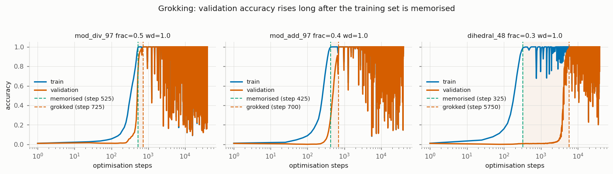
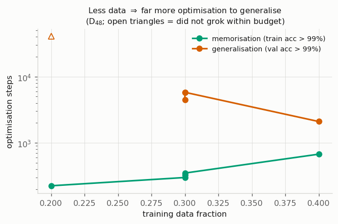
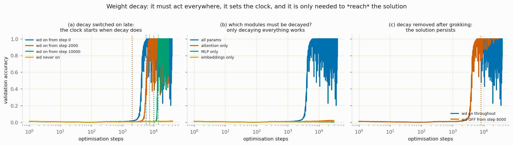
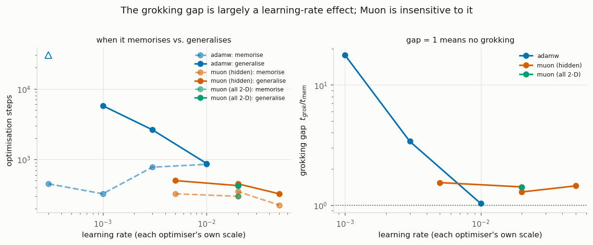
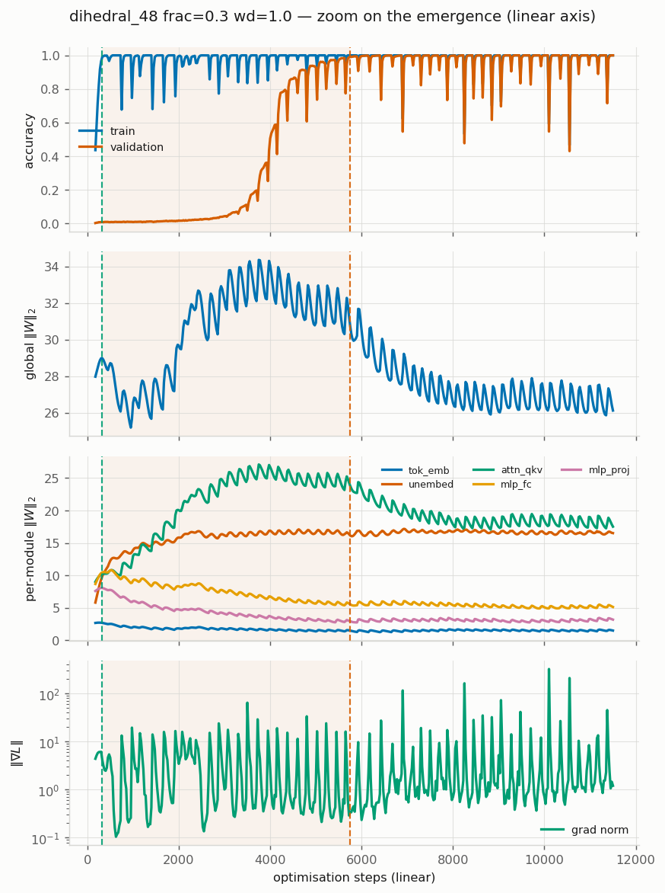
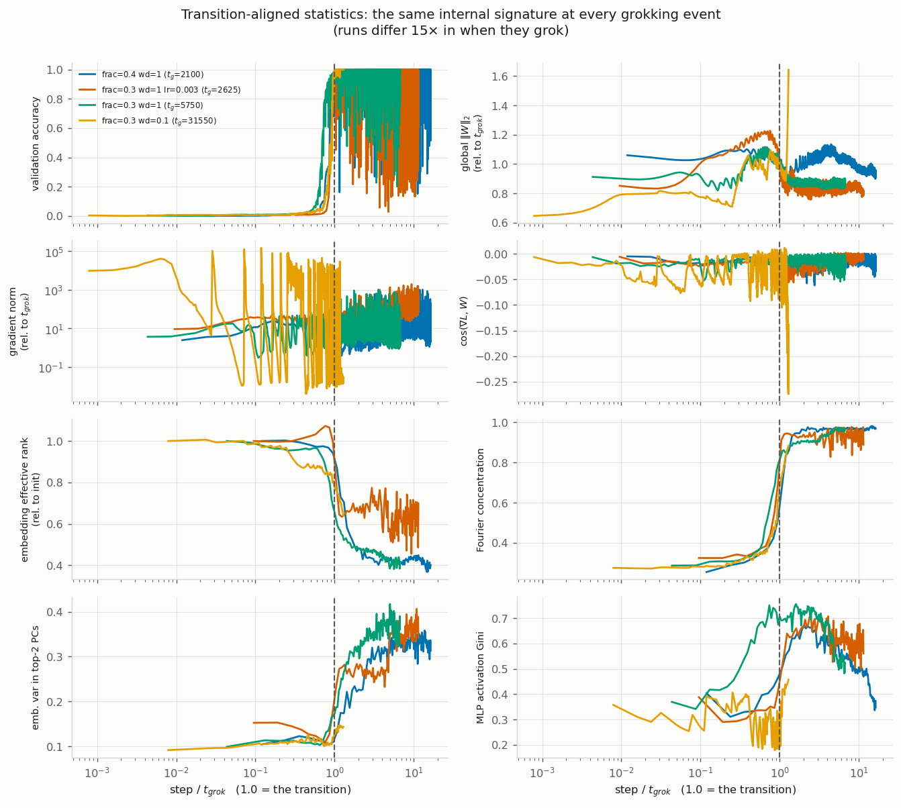
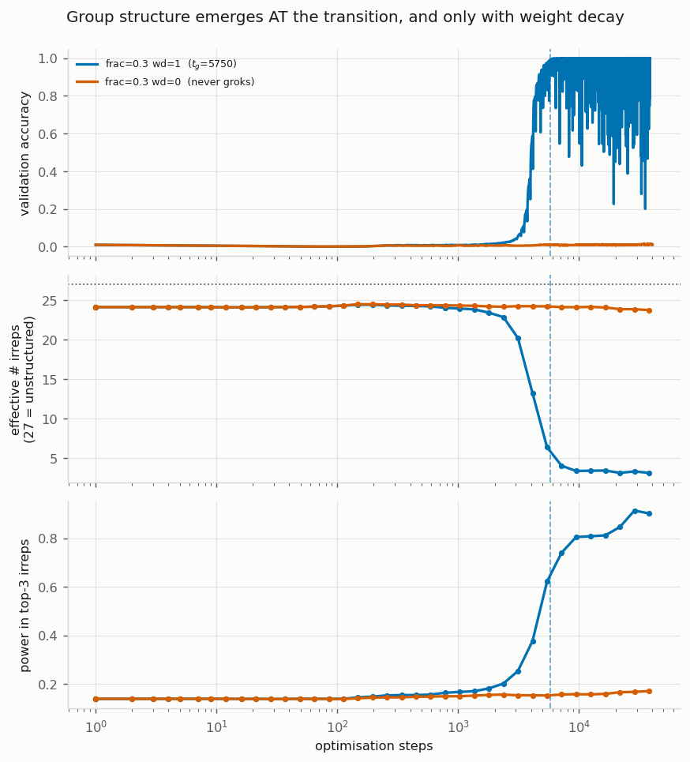
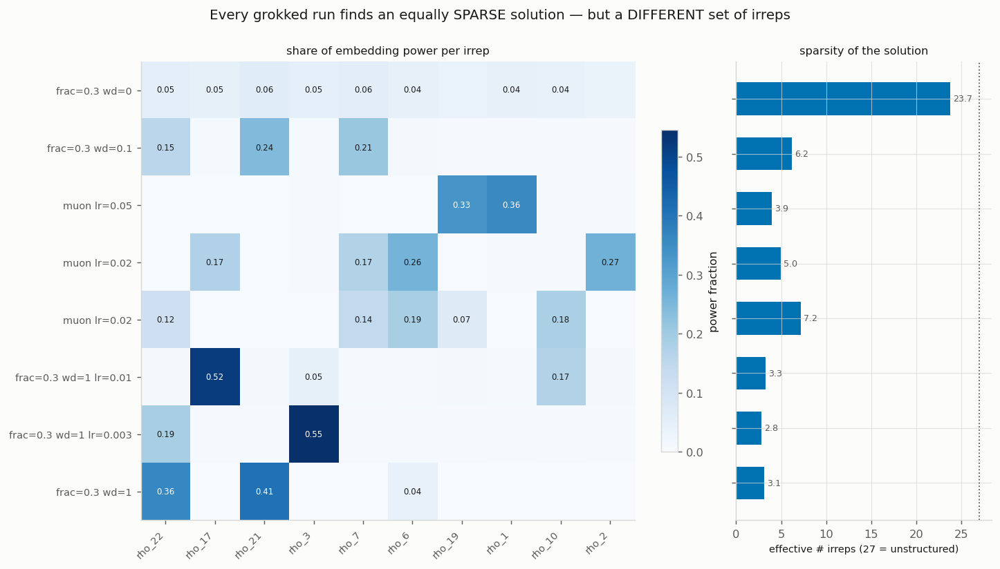
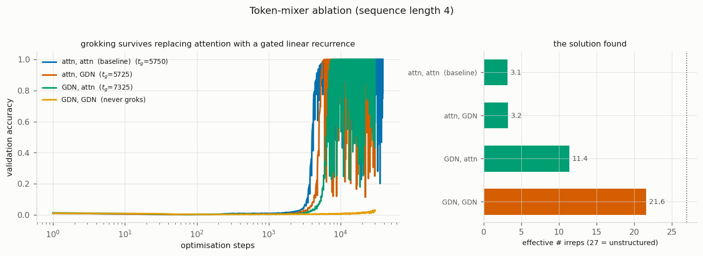

# Grokking in a non-abelian group: what actually changes at the transition

A mechanistic study, reproducing Power et al. (2022) and extending it to a new dataset.
Code, configs, logs and all 19 figures are in this directory. `EXPERIMENT_LOG.md` has the
blow-by-blow, including the parts that went wrong.

## Headline findings

Throughout, we describe grokking by its **gap**: the step at which the model first scores
99% on the data it was trained on, divided by the step at which it first scores 99% on
held-out data. A gap near 1 means it learned and generalised at the same time, which is
ordinary training. A gap of 17 means it sat at chance on held-out data for seventeen times
as long as it took to memorise.

- **Grokking reproduces on a new dataset.** We built a task the original paper never used:
  composing the symmetries of a 48-sided polygon (its rotations and flips), presented to
  the network as 96 meaningless symbols with no hint of what they stand for. The network
  learned all 2765 training examples by step 325 while still scoring at chance on held-out
  ones, then jumped to perfect held-out accuracy at step 5750. A gap of 17.7, reproduced on
  a second random seed.

- **Whether a task groks depends on how you train it, not just on the task.** The identical
  dataset gave a gap of 1.05 (ordinary learning, no grokking at all) when we showed the
  network half the multiplication table, 17.7 when we showed it 30%, and no generalisation
  whatsoever within our budget at 20%. Weight decay and learning rate each move it by a
  comparable amount on their own. So "does model X grok on task Y" has no answer unless the
  training setup is specified too.

- **Most of the delay is just the learning rate.** We first believed a newer optimiser,
  Muon, had abolished grokking, since it generalised almost immediately where AdamW took
  5750 steps. Sweeping the learning rate showed that plain AdamW does the same thing if you
  simply turn it up: the gap falls from 17.7 to 1.0 as the learning rate goes from 0.001 to
  0.01. The long plateau is therefore mostly a symptom of taking small steps, not a
  fundamental obstacle to learning the rule. Muon's genuine advantage is narrower: it gives
  a small gap at every learning rate we tried, without tuning, and stays stable where
  high-learning-rate AdamW falls apart.

- **At the jump, the network stops storing symbols and starts representing the symmetry.**
  Group theory says any representation of a group breaks down into a fixed set of
  irreducible building blocks, and this group has 27 of them. While memorising, the network
  spreads its representation almost evenly across all 27, which is what an unstructured
  lookup table looks like. At the moment held-out accuracy climbs, that collapses onto about
  3. Most of the surviving structure sits in the blocks encoding the genuinely
  non-commutative part of the group, the part where swapping the two inputs changes the
  answer.

- **That count predicts success better than anything else we measured.** Every run that
  eventually generalised ended up using between 3 and 11 of the 27 building blocks. Every
  run that never generalised stayed at 23 to 24, meaning essentially unstructured. This
  held when we changed the optimiser, the learning rate, the weight decay, and even when we
  replaced the attention mechanism with a different architecture entirely.

- **Weight decay is not background regularisation here, it is the cause.** Weight decay is
  normally thought of as gentle pressure keeping weights small and discouraging
  overfitting. Switch it off here and the network memorises at step 275 and then never
  generalises, through 40,000 steps. It also behaves like a timer: whenever you switch it
  on, generalisation arrives roughly 4000 to 5000 steps later, whether that is at step 0 or
  step 10,000. It has to act on the whole network, since decaying only the attention layers,
  only the MLP, or only the embeddings all fail outright. And once the network has
  generalised you can switch it off and the solution survives.

- **Grokking is not something attention does.** Replacing one of the two layers with a
  completely different token-mixing mechanism, a gated linear recurrence, groks at step 5725
  against the baseline's 5750 and arrives at an equally compact representation. Replacing
  both layers never groks at all, which we cannot explain.

- **Nothing warns you it is about to happen.** We looked for any statistic that starts
  moving before held-out accuracy does, including one built specifically from the group's
  own structure. Everything we measured moves at the jump, not before it. On this task there
  is no early-warning signal to stop on.

---

## 1. What grokking is

Grokking breaks the usual relationship between fitting and generalising. Train a small
transformer on a table of algebraic equations with some held out, and it reaches perfect
training accuracy within a few hundred steps while validation accuracy sits at chance.
The training loss goes flat. By every standard diagnostic the run is over: the model has
memorised a lookup table, and there is nothing left to learn.

Keep training and that turns out to be wrong. Thousands of steps after the training loss
stops moving, validation accuracy lifts off the floor and climbs to 100%. The network
that was storing answers is now computing them.

In our main run the two events are separated by a factor of 17.7. Training accuracy
passes 99% at step 325 and validation accuracy at step 5750, with some five thousand
steps in between during which the loss curve shows essentially nothing. Power et al.
(2022) named the effect and demonstrated it on modular arithmetic and on the symmetric
group S₅.

Two things make it worth studying. Practically, every sensible stopping criterion fires
long before the interesting part, so the phenomenon is easy to train straight past.
Theoretically, weights that encode a memorised table become weights that encode an
algorithm without the loss registering the change, which suggests the structure that
matters is not visible in the loss at all.

This study asks what is different inside the network on either side of that jump, and
which knobs control when, and whether, it happens.



---

## 2. Setup

Architecture and optimisation follow the paper's Appendix A.1.2, which we read rather
than reconstructed from memory, since the hyperparameters turn out to matter a great deal.

| | |
|---|---|
| Architecture | decoder-only transformer, causal mask, pre-LN |
| Layers / width / heads | 2 / 128 / 4 |
| Non-embedding parameters | 394,496 (the paper says "about 4·10⁵") |
| Baseline optimiser | AdamW, lr 1e-3, β = (0.9, 0.98), weight decay 1.0 |
| Optimisers implemented | AdamW; Muon (Newton-Schulz orthogonalisation, with hidden-only or all-2D routing); Adam with coupled L2; SGD with Nesterov momentum; RMSprop |
| Token mixers implemented | softmax attention, Gated DeltaNet, or one of each |
| Schedule | 10-step linear warmup, then constant. The paper deliberately does not anneal. |
| Batch | min(512, half the training set) |
| Hardware | one NVIDIA RTX 3090 Ti (24 GB), 16 CPU cores, PyTorch 2.7.1 / CUDA 12.6 |
| Compute | ≈1.0M optimisation steps across 40 runs; roughly 10 hours of summed run time, a few hours elapsed at 8 to 13 concurrent jobs |

Equations are presented as abstract symbols with no internal structure. The network sees
opaque token ids, never a number, and has to infer the operation from the table alone.
The paper writes each equation as five tokens, `⟨x⟩⟨op⟩⟨y⟩⟨=⟩⟨x∘y⟩`, with loss on the
answer only; we feed the four-token prefix and read logits at the last position, which
under a causal mask is the same computation.

One practical note, because it shaped how everything was run. At this size the model
cannot occupy a GPU: during training the 3090 Ti sat at 2% utilisation and idle clocks,
entirely CPU kernel-launch bound. That is slow for a single run (131 steps/s with fused
AdamW, 72 without) and ideal for a study, since a dozen runs execute concurrently without
contending for anything. The binding constraint on parallelism was CUDA context memory,
roughly 800 MB per process, which we hit once by launching thirteen jobs at the same
instant.

---

## 3. The dataset

The paper's task list is modular arithmetic on ℤ₉₇ (eight bivariate polynomials plus one
conditional operation) and three operations on the symmetric group S₅. We wanted
something outside that list, and settled on composition in the **dihedral group D₄₈**.

D_n is the symmetry group of a regular n-gon: n rotations and n reflections, 2n elements
in total. Writing elements as `r^i s^f` with `i ∈ ℤ_n` and `f ∈ {0,1}`, the relation
`sr = r⁻¹s` gives

```
(i, f) · (j, g) = ( i + (−1)^f · j  mod n ,  f ⊕ g )
```

At n = 48 that is 96 elements and 9216 equations, chosen to sit close to the paper's 9409
so that dataset size is not a confound. Rotations are indexed 0 to 47 and reflections 48
to 95, keeping the two cosets contiguous for later analysis.

Some concrete equations, with the token sequence the network actually sees (96 is the
`<op>` token, 97 is `<=>`, and the answer is read from the logits at the last position):

| a | b | a · b | tokens | |
|---|---|---|---|---|
| r⁵ | r¹² | r¹⁷ | `[5, 96, 12, 97] → 17` | rotation times rotation stays a rotation |
| r⁵ | r¹²s | r¹⁷s | `[5, 96, 60, 97] → 65` | rotation times reflection gives a reflection |
| r⁵s | r¹² | r⁴¹s | `[53, 96, 12, 97] → 89` | the (−1)^f term flips the sign of the second index |
| r⁵s | r¹²s | r⁴¹ | `[53, 96, 60, 97] → 41` | reflection times reflection returns a rotation |
| r⁵s | r⁵s | e | `[53, 96, 53, 97] → 0` | every reflection is its own inverse |

The third and fourth rows are where the group stops being abelian: r⁵s · r¹² = r⁴¹s
while r¹² · r⁵s = r¹⁷s. The network has to learn that the first operand's reflection bit
changes how the second operand's rotation is applied, which is exactly the structure a
bag-of-operands shortcut cannot capture.

Three things made this attractive. It is non-abelian, so operand order matters; the paper
notes that symmetric operations are easier for a transformer, which can simply ignore
positional information, making the asymmetric case more interesting. It is a semidirect
product ℤ₄₈ ⋊ ℤ₂, structurally between the cyclic modular-arithmetic tasks and the S₅
tasks, duplicating neither. And it is "half abelian", which raised a question we could
test: does the network learn the cyclic factor and the reflection bit at different times?
(It does not. They move together.)

We verified the generated operation table directly for closure, a two-sided identity,
unique inverses, associativity on 2000 random triples, and non-commutativity, before
training anything. `mod_div_97` (the paper's Figure 1 task) and `mod_add_97` were kept as
controls.

### The regime matters more than the task

Our first D₄₈ run used 50% training data, the paper's Figure 1 split. It memorised at
step 475 and generalised at step 500. No gap, no grokking, just ordinary learning. For
about ten minutes it looked as though the new task simply did not exhibit the phenomenon.
It does. 50% data is just too much.

| train fraction | memorised at | validation accuracy at step 4000 |
|---|---|---|
| 0.15 | 200 | 0.002 |
| 0.20 | 300 | 0.005 |
| 0.25 | 300 | 0.018 |
| 0.30 | 400 | 0.737 (mid-transition) |
| 0.40 | 700 | 1.000 (grokked at 2100) |

We settled on 30% for the main runs. This is the first result worth stating plainly:
**grokking is a regime, not a property of a task.** Asking "does D₄₈ grok?" is not
well-posed without specifying the data fraction, the weight decay and the learning rate,
each of which we later found moves the gap by more than an order of magnitude.

At 30% data, with the paper's hyperparameters: memorised at step 325, generalised at step
5750. A gap of 17.7×, reproduced at a second seed (350 to 5800, 16.6×).

---

## 4. How we scoped and instrumented the study

### Framing and prioritisation

The brief was open-ended: reproduce grokking and study it in as much detail as possible,
on a fixed time budget. Five decisions shaped what follows, and they are worth stating
because they constrain what the results can support.

**Reproduce before extending.** `mod_div_97` and `mod_add_97` were run as controls from
the start, so that a new task failing to grok would be a finding rather than an
unattributable failure. That turned out to matter, though not in the way intended: the
control disagrees with the paper by two orders of magnitude (§8), so the analysis rests on
the new task instead.

**One new dataset, studied properly, rather than several sampled shallowly.** Grokking
runs are cheap, so the temptation is to add tasks. We took the opposite view: a single
task with eight axes probed on it yields more than eight tasks with one axis each, because
the interesting claims are about what varies *within* a task.

**Choose the dataset for analysability, not novelty alone.** D₄₈ is new relative to the
paper, but it was chosen because it is non-abelian (the harder regime the paper flags),
because it could be size-matched to their tasks so dataset size is not a confound, and
because it has a known representation theory. That last point was speculative insurance at
the time and became the central result: when we needed a mechanistic measure, one already
existed for this group.

**Find the regime before spending the budget.** The first run, at the paper's 50% split,
showed no grokking at all. Rather than assume the task was wrong we ran a cheap scan over
the training fraction with light logging, found the transition at 30%, and only then
committed the main runs. Roughly ten minutes of compute redirected the whole study.

**Let results reprioritise the plan.** Two of the eight axes were not in the original plan.
The learning-rate sweep was added because an optimiser comparison turned out to be
confounded, and the architecture axis because it tests whether any of this is specific to
attention. Both changed conclusions.

Deliberately not done, and why: multi-seed everything (one axis of variance traded for
seven axes of coverage), depth and sequence-length sweeps (out of budget), and causal
ablation of the irrep structure (the analysis that motivates it only existed near the end).

### The axes

Eight axes, 33 runs.

- **Training fraction** 0.15, 0.20, 0.25, 0.30, 0.40, 0.50
- **Weight decay magnitude** 0, 0.1, 1.0, 10
- **Weight decay timing** switched on at step 2000 or 10000, or switched off at step 8000
- **Weight decay locality** applied to attention only, MLP only, or embeddings only
- **Learning rate** 3e-4, 1e-3, 3e-3, 1e-2
- **Optimiser** AdamW, Muon (hidden-only or all-2D routing), Adam with coupled L2,
  SGD with Nesterov momentum, RMSprop
- **Architecture** softmax attention or Gated DeltaNet in either of the two layers
- **Seed** two seeds on the headline condition

### Instrumentation: information per run

Every run was treated as something that would be asked new questions later, because it was.

**Two logging cadences.** Cheap statistics every 25 steps, expensive ones every 250. The
split exists because the transition has to be resolved densely, but SVDs and probes cannot
run at that rate. Measured overhead of the whole instrumentation: 131 steps/s down to 96,
about 27%, which we accepted deliberately rather than by default.

- Per-module weight norms, and the ratio to their value at initialisation
- Per-module gradient norms
- Grad-weight alignment, `cos(∇L, W)`, separating growing the norm from rotating the solution
- Update geometry: step size, and the cosine between consecutive updates
- Logit magnitudes and correct-class margins on train and validation
- Singular spectra of the embedding, unembedding and MLP matrices, with stable and
  effective rank
- Fourier concentration of the embedding over the cyclic subgroup
- MLP activation sparsity (Gini coefficient) and dead-neuron fraction
- Embedding variance explained by the top two principal components
- Decomposition into the 27 irreducible representations of D₄₈

**Full checkpoints on a log-spaced grid, about 40 per run.** This is the decision that paid
off most. The irrep analysis, which produced the central mechanistic result of the study,
was conceived and written *after every run had finished*, and cost **zero additional GPU
time**: it reads checkpoints already on disk. The same is true of the transition-aligned
comparison and the faithfulness check. A study that logged only scalars would have had to
retrain everything to ask those questions.

**One schema for every run.** Identical CSV columns across all 33 runs is what makes
cross-run analysis possible at all, including rescaling four runs by their own transition
points and overlaying them (§5.4), which was not planned in advance.

**Line-buffered, append-mode CSVs.** The analysis code was developed against partial
results while runs were still going, so figure debugging overlapped with training instead
of following it.

**Concurrency chosen from a measurement, not a guess.** Profiling showed the GPU at 2%
utilisation and idle clocks: the workload is CPU launch-bound, so 8 to 13 runs execute
concurrently without contending for compute. The binding constraint is CUDA context memory,
about 800 MB per process. The same profiling picked fused over unfused AdamW, worth 1.8×,
and rejected CUDA graphs despite a further 2.6× because they would have broken the
activation capture.

**Budget set by calibration.** Throughput was measured before the grid was launched and
the step budget set from it, rather than picking a round number and hoping.

## 5. Results

Each subsection below states the hypothesis we went in with, what was actually varied to
test it, what came out, and what it changes about the overall picture.

### 5.1 Data efficiency

**Hypothesis.** The paper reports that the optimisation time needed to generalise grows
sharply as the training fraction falls, while time to memorise does not. That should hold
on a task they never ran, if the effect is general rather than specific to modular
arithmetic.

**Test.** D₄₈ at training fractions 0.15 through 0.50, everything else held at the
paper's settings, recording the step at which train and validation accuracy each pass 99%.

**Finding.** Memorisation time barely moves: 225 steps at 20% data, 675 at 40%.
Generalisation time explodes: 2100 steps at 40%, 5750 at 30%, and nothing within 40,750
steps at 20%.



**Implication.** The gap is not a property of the task, it is a property of how much of
the operation table the network can see. This is what forces the regime framing used
everywhere below: the same dataset is a grokking dataset or an ordinary one depending on
the split.

### 5.2 Weight decay

**Hypothesis.** The paper finds weight decay "particularly effective at improving data
efficiency", which reads as a regulariser biasing the network toward the simpler solution.
On that account, more decay should shift the transition earlier, and the effect should be
roughly proportional to how much the weights are being shrunk.

**Test.** Four separate manipulations. Magnitude at 0, 0.1, 1.0 and 10. Onset, training
with no decay and switching it on at step 2000 or 10,000. Removal, switching it off at
step 8000 after the transition. Locality, restricting decay to the attention matrices, the
MLP, or the embeddings. Plus matched `lr·wd` products, since decoupled AdamW shrinks
weights by `w ← w(1 − lr·wd)` per step and the product is the natural candidate for the
real control variable.

**Finding.** Magnitude sets the timescale steeply: 5750 steps at wd = 1.0, 31,550 at
wd = 0.1, and no generalisation at all in 40,600 steps at wd = 0, despite perfect
memorisation by step 275. Because memorisation time barely moves, the wd = 0.1 run has a
gap of 114.7×, the largest we recorded.



Onset was the surprise. The transition follows the switch-on by a roughly fixed interval,
whenever it happens:

| decay switched on at | memorised | grokked | steps after onset |
|---|---|---|---|
| 0 | 325 | 5750 | 5750 |
| 2000 | 275 | 7325 | 5325 |
| 10000 | 275 | 14150 | 4150 |
| never | 275 | never | |

Locality produced a clean negative: attention-only, MLP-only and embedding-only decay all
memorise at step 275 and none generalise across the full 30,000 steps. Removal showed an
asymmetry: switch decay off after the transition and validation accuracy stays at 1.000.
And the product rule holds only locally, with (3e-3, 0.333) groking at 6150 against 5750
for (1e-3, 1.0), but (1e-2, 0.1) taking 10,525 steps and (1e-3, 10) failing to fit the
training set at all.

**Implication.** Weight decay is not biasing the endpoint of an otherwise unchanged
optimisation, it is driving the transition. The memorising solution is a stable attractor
that persists indefinitely when left alone, and decay dislodges it on its own timescale
rather than tipping it out immediately. The locality result is the sharpest constraint on
any mechanistic story: whatever decay does, it cannot be "shrink the module that grew",
because the entire norm rise is carried by attention (§5.4) and decaying attention alone
does nothing.

### 5.3 Learning rate and optimiser

**Hypothesis.** Our initial one, which turned out to be wrong. Muon constrains the
spectral geometry of each update, so if grokking is the slow removal of a high-norm
memorising solution, an optimiser with a different update geometry might skip that phase.
Muon at its standard 0.02 gave a gap of 1.4× against AdamW's 17.7×, which looked like a
clean optimiser effect.

**Test.** Sweep the learning rate for both, rather than comparing one setting each. Muon's
Newton-Schulz update carries roughly unit *spectral* norm and AdamW's roughly unit
*max-abs* norm, so their learning rates are not on a common scale and matching them
numerically would be the unfair comparison, not the fair one.

**Finding.**

| optimiser | lr | memorised | grokked | gap | stable at the end |
|---|---|---|---|---|---|
| AdamW | 3e-4 | 450 | never in 30k | | yes |
| AdamW | 1e-3 | 325 | 5750 | 17.7× | yes |
| AdamW | 3e-3 | 775 | 2625 | 3.4× | yes |
| AdamW | 1e-2 | 850 | 875 | 1.0× | no, ends at 33% train accuracy |
| Muon | 5e-3 | 325 | 500 | 1.5× | yes |
| Muon | 2e-2 | 350 | 450 | 1.3× | yes |
| Muon | 5e-2 | 225 | 325 | 1.4× | yes |



AdamW at 1e-2 also reaches a gap of 1.0, so the hypothesis as stated is false. What
survives is narrower: Muon is *insensitive* to the setting, holding 1.3 to 1.5× across a
tenfold range, while AdamW swings from 17.7× to 1.0× and its zero-gap point is unstable,
collapsing to 33% training accuracy after having reached 100%.

A detail that also killed our original supporting argument: as the AdamW learning rate
rises, memorisation time *increases* (325 to 850) while generalisation time *falls* (5750
to 875). The two phases move in opposite directions, so "memorisation time is unchanged
under Muon" never ruled out a step-size explanation, though we had used it that way.

**Implication.** Most of the delay is an optimisation artefact rather than a fundamental
barrier to learning the rule. That reframes the phenomenon: the long plateau is not the
network needing time to discover the algorithm, it is the optimiser taking a slow path to
something reachable much faster under other settings. It also raises the question §5.5
answers, of whether the fast and slow paths arrive at the same place.

### 5.4 What moves at the transition

**Hypothesis.** The standard account is that the weight norm grows while the network
memorises and then falls as decay pushes it onto the general solution. If so, the global
norm should peak at the transition, and the internal statistics should show a
characteristic signature there.

**Test.** Per-module weight and gradient norms at 25-step resolution through the
transition, and then a stronger version: rescale each run's step axis by its own `t_grok`
and overlay runs that grok at very different times. If the signature is a property of the
transition rather than of the run, the curves should collapse.

**Finding.** The global story holds: 28.0, peaking at 34.4 around step 3750 just as
validation accuracy starts to move, then down to 26.5. But it is carried almost entirely
by one module.

| module | at memorisation | peak | final | |
|---|---|---|---|---|
| attention QKV | 10.22 | 27.07 (step 3750) | 16.86 | grows, then shrinks |
| unembedding | 9.86 | 18.58 | 17.42 | grows, then flat |
| MLP fc | 10.47 | 10.81 | 4.42 | shrinks throughout |
| MLP proj | 8.07 | 8.07 | 3.26 | shrinks throughout |
| token embedding | 2.70 | 2.74 | 1.34 | shrinks throughout |



The alignment test worked better than expected. Four runs grokking at 2100, 2625, 5750 and
31,550 steps, produced by different data fractions, weight decays and learning rates,
collapse onto essentially one curve for accuracy, Fourier concentration, effective rank
and embedding PCA variance alike.



Two details are visible only in that view: the global norm peaks slightly *before* the
jump, at about 0.85·t_grok, and `cos(∇L, W)` dips sharply negative exactly at it, as the
gradient briefly turns against the weight vector.

**Implication.** Whatever sets *when* grokking happens, *what happens* internally is the
same event every time, which justifies treating it as one phenomenon across a 15× spread
in timing. The per-module breakdown localises the memorising solution to attention, and
sets up the tension with §5.2: attention holds the memorised content, yet decaying
attention alone will not remove it.

### 5.5 The mechanism

**Hypothesis.** If the network has genuinely learned the group rather than the table, its
representation of the elements should be sparse in the group's own natural basis. For a
cyclic group that basis is the Fourier basis; for a non-abelian group it is the
decomposition into irreducible representations, which the cyclic Fourier measure we had
been using structurally cannot see. And if hidden progress happens anywhere during the
plateau, this is the measure that should reveal it.

**Test.** D₄₈ has 27 irreps, four one-dimensional and twenty-three two-dimensional, with
4·1 + 23·4 = 96 = |G|. Treating each of the 128 embedding dimensions as a function on the
group, decompose the power across irreps at every saved checkpoint, checking each
decomposition against Parseval. Summarise with the effective number of irreps in use, the
inverse Simpson index of the power spectrum: 27 means uniform, so no group structure, and
1 means a single irrep carries everything.

**Finding.**

| | step |
|---|---|
| memorised | 325 |
| effective irreps across the whole plateau (325 to 2000) | flat at 23.4 to 24.3 |
| validation accuracy > 0.05 | 3100 |
| effective irreps first below 20 | 4117 |
| validation accuracy > 0.99 | 5750 |



The embedding is unstructured in the group basis through the entire plateau, then
collapses from 24 to about 3 in lockstep with the accuracy jump. In the grokked network,
87% of the embedding power sits in *two-dimensional* irreps, precisely the non-abelian
structure the cyclic measure was blind to. The wd = 0 run sits at 23.7 for its entire
40,000 steps.

Comparing final solutions across conditions gave the result we did not expect:

| run | grokked at | effective irreps | dominant |
|---|---|---|---|
| AdamW 1e-3 | 5750 | 3.1 | ρ₂₁, ρ₂₂ |
| AdamW 3e-3 | 2625 | 2.8 | ρ₃ |
| AdamW 1e-2 | 875 | 3.3 | ρ₁₇ |
| AdamW wd 0.1 | 31550 | 6.2 | ρ₂₁, ρ₇ |
| Muon 0.02 | 450 | 5.0 | ρ₂, ρ₆ |
| Muon 0.05 | 325 | 3.9 | ρ₁, ρ₁₉ |
| AdamW wd 0 | never | 23.7 | none |



A follow-up check sharpens what "sparse" means here. We asked whether the surviving
irreps are *sufficient*, that is whether they can still tell all 96 group elements apart:

| irreps kept | elements separated |
|---|---|
| ρ₂₁ alone | 32 of 96 |
| ρ₂₁ + ρ₂₂ | **96 of 96, faithful** |

Neither of the top two is faithful on its own. ρ₂₁ collapses the group 3-to-1, since
gcd(21, 48) = 3 means it cannot distinguish `r^i` from `r^(i+16)`; ρ₂₂ collapses it 2-to-1.
Their blind spots are coprime, so together they separate everything. The network did not
merely become sparse, it compressed to *the minimum structure sufficient to represent the
group faithfully*, and stopped there.

**Implication.** This is the mechanism the rest of the study was circling. Grokking on
this task is the collapse of a high-rank, group-unstructured memorising solution onto a
sparse set of irreducible representations, close to the smallest set that can still
distinguish the group elements, and the effective irrep count is the best single
discriminator we found between runs that generalise and runs that never do.

It also answers the question left open by §5.3, and not in the direction we expected.
Every grokked run is sparse, but *which* irreps differ by optimiser and learning rate.
Universality of form, not of content: the algorithm class is invariant while the
representation basis is not. Learning rate and optimiser therefore do not merely change
the path length to a fixed destination, they select among many equivalent sparse
solutions.

And it sharpens the negative result. Even this measure, the one designed for the task, is
flat through the plateau. There is no hidden progress to find.

### 5.6 Is grokking a property of attention?

**Hypothesis.** Every result so far comes from a softmax-attention transformer. If the
phenomenon depends on attention's particular inductive bias, replacing the token mixer
should change or remove it. If instead it belongs to the task and the optimisation, a
different mixer should grok too.

**Test.** Keep the depth at two layers and swap one or both layers for a Gated DeltaNet, a
gated linear attention with a matrix-valued recurrent state. All variants stay within
0.55% of the baseline parameter count, so capacity is not the variable.

**Finding.**

| layers | memorised | grokked | effective irreps |
|---|---|---|---|
| attention, attention | 325 | 5750 | 3.1 |
| attention, GDN | 725 | 5725 | 3.2 |
| GDN, attention | 275 | 7325 | 11.4 |
| GDN, GDN | 650 | never | 22.9 |



One attention layer plus one GDN layer groks at step 5725 against the baseline's 5750, a
0.4% difference, and lands on 3.2 effective irreps against 3.1, on a different set. Pure
GDN memorises at step 650 and never generalises, sitting at 22.9 effective irreps: the
same unstructured signature as training with no weight decay.

**Implication.** Neither grokking nor the sparse group-representation solution is specific
to softmax attention, which makes it a property of the task and the optimisation rather
than of one architecture. The hybrid also independently reproduces the form-not-content
result from §5.5. The failure of the pure-GDN model is the loose end: one attention layer
appears to be necessary and one is sufficient, and we do not have an explanation.

A caveat on scope: our sequences are four tokens long, so GDN's actual advantage, a
fixed-size recurrent state in place of quadratic attention over long contexts, is inert
here. This is a token-mixer ablation, not a statement about GDN as a long-context
mechanism.

### 5.7 Three hypotheses that did not survive

**Post-grokking instability.** Our accuracy curves oscillate violently after the
transition, dropping from 1.0 to 0.2 and recovering, which the paper's do not. The obvious
suspect was weight decay applied to LayerNorm gains: with the loss near zero there is no
gradient to oppose the decay, so the normalisation scale is driven toward zero. We tested
it by excluding one-dimensional parameters from decay. The mechanism is real, the
LayerNorm norm falls from 27 to 7 when decayed and grows to 60 when excluded, but the
oscillation did not go away. Over the post-transition window the "fixed" run has 14.1% of
evaluations below 0.95 against the original's 12.0%. Rejected. Our remaining guess is the
constant learning rate, which the paper explicitly chose not to anneal, and we did not
test it.

**An early-warning signal.** We expected something to move before the accuracy jump.
Measuring what fraction of each statistic's total change falls inside the window
[0.3, 2.0]·t_grok: validation accuracy 0.99, Fourier concentration 0.87, embedding
effective rank 0.81, PCA variance 0.79. The structural measures are step-like and
essentially simultaneous with the jump, not before it, and §5.5 shows the same for the
irrep decomposition. Nothing we measured anticipates the transition.

**A probe that measured nothing.** A linear probe for the reflection bit of D₄₈ read 1.00
from step 0. Ninety-six points in 128 dimensions are linearly separable under any binary
labelling at random initialisation, so the probe was uninformative by construction rather
than telling us the ℤ₂ factor was learned early.

## 6. What we got wrong

Three conclusions in this study were wrong until measured, and all three were caught the
same way, by computing a number instead of trusting a plot.

The LayerNorm explanation above looked obviously right in the figure; the statistics said
otherwise. The claim that Muon abolishes grokking survived until someone asked why its
learning rate was twenty times AdamW's, and an LR sweep showed AdamW does the same thing
at 1e-2. And an early version of our event-ordering figure implied several statistics led
the accuracy jump, which was an artefact of the metric: "step at which half the total
change is complete" fires early for anything drifting monotonically, which is drift, not
anticipation.

There were also two ordinary bugs with real consequences. Our Muon parameter routing sent
the token embedding and output head to Muon, against standard practice, which mattered
because the embedding is exactly where we measure structure, so orthogonalising its update
could have manufactured the result. It did not, as it happens: restricting Muon to hidden
matrices gives 1.3× against 1.4×. Separately, the module-grouping code did not recognise
GDN parameter names, so it would have silently dropped every GDN weight from the norm
statistics. That one was caught by asserting that the per-group parameter counts sum to
the model's total.

---

## 7. Conclusions

**Grokking is a regime, not a task property.** The same dataset shows a gap of 1.05× at
50% data, 17.7× at 30%, and no generalisation at all at 20%. Weight decay, learning rate
and data fraction each move the transition by more than an order of magnitude
independently. Any statement of the form "model X groks on task Y" is underspecified.

**The delay is largely an optimisation artefact rather than a fundamental barrier.** It
can be tuned away. AdamW spans 17.7× to 1.0× over one decade of learning rate, and Muon
sits near 1.3× across a tenfold range while staying stable. The long plateau is not the
network needing time to find the rule; it is the optimiser taking a slow path to a
solution reachable much faster under other settings.

**The transition is a collapse from high-rank memorisation onto a sparse set of
irreducible representations.** Embedding effective rank falls from 85 to 35, the
representation goes from 24 effective irreps to about 3, and 87% of the surviving power
sits in two-dimensional irreps. Every grokked run finds three to eleven; every
non-generalising run stays at 23 to 24. Across optimisers, learning rates, weight decays
and architectures, that single number separates the two outcomes better than anything else
we measured.

**Weight decay is a mechanism, not a regulariser.** It must act on all modules; decaying
attention alone fails, despite attention carrying the entire norm rise. It starts the
transition clock when it is switched on, whenever that is. And it is required to reach the
solution but not to maintain it.

**Nothing anticipates the jump.** Neither generic statistics nor the task-specific
representation-theoretic measure show progress during the plateau. If a usable
early-warning signal for grokking exists, it is not in anything we measured here.

---

## 8. What is still uncertain

### Open questions

These are the things we would test next, roughly in order of how much they would change
the picture.

**Is the irrep collapse causal, or a correlate?** We never intervened on it. The test is
ablation: zero every irrep component except the dominant few and check whether validation
accuracy survives, then force a sparse representation early and see whether generalisation
follows. Until that is run, "the transition is a collapse onto a few irreps" is a
description of what co-occurs with generalisation, not a demonstration that it causes it.

**Why does pure Gated DeltaNet fail?** It memorises normally and then stays at 22.9
effective irreps forever, the same signature as training without weight decay. One
attention layer is enough to fix it. We have no account of what attention supplies that
the recurrence does not, and this is the most conspicuous loose end in the study.

**Why does our `mod_div_97` control disagree with the paper by 100×?** It groks at step
725 against roughly 10⁵ in their Figure 1, on hyperparameters matched to their appendix.
The ordering is right and the magnitude is not. Candidate causes are initialisation scale
and their unstated handling of weight decay on 1-D parameters, neither tested.

**What causes the post-grokking oscillation?** Our leading hypothesis was tested and
rejected (§5.7). The remaining suspect is the constant learning rate, which the paper
explicitly chose not to anneal. One annealing run would settle it and we did not do it.

**Is there an early-warning signal in a measure we did not try?** Nothing we logged moves
before the jump. The obvious untried candidate is restricted and excluded loss: project
the weights onto the dominant irrep subspace and its complement and evaluate each. If the
restricted loss falls during the plateau, the circuit is forming invisibly after all, and
our negative result is a statement about our measures rather than about the network.

**Which irreps, and why those?** Every grokked run picks a small set, and different runs
pick different sets. Whether the choice is arbitrary, seeded by initialisation, or
structured (the two dominant ones here have coprime kernels, which is exactly the
condition for their sum to be faithful) is not something we can answer from thirteen runs.

**Does any of this depend on depth?** Everything here is two layers.

### Limitations on what we do claim

Most ablations are single-seed; only the headline D₄₈ condition was repeated. Every "never
groks" means within the step budget used, 30,000 to 40,850 steps, and is not a proof of
impossibility. The whole study is at two layers and four-token sequences, so nothing here
speaks to depth or sequence length, and in particular the Gated DeltaNet comparison says
nothing about its behaviour as a long-context mechanism. The coupled-L2 optimisers were run
at one learning rate each and are confounded with the decay coupling, so their failures
should not be read as statements about SGD or RMSprop. The irrep measure is computed on the
token embedding only, not on the full computation. And it is task-specific by construction:
it exists because D₄₈ is a group with known representation theory, so it is not a
general-purpose grokking detector.

## 9. Reproducing

This directory is self-contained. Beyond the Python standard library it needs only torch,
numpy, pandas, matplotlib and pyyaml; the Muon optimiser is vendored as `muon.py` and the
Gated DeltaNet layer in `gdn.py` is a dependency-free implementation, so nothing imports
from the parent repository.

```bash
python data.py           # verify the group axioms and dataset sizes
python model.py          # verify the parameter count
python gdn.py            # verify the Gated DeltaNet layer is causal
bash run_grid.sh         # all runs (stagger the launches)
python analysis.py       # regenerate every figure into figures/
```

33 runs, `results_summary.csv` for the full table, `analysis.ipynb` for the same figures
interactively, and `EXPERIMENT_LOG.md` for the blow-by-blow including the parts that went
wrong.
