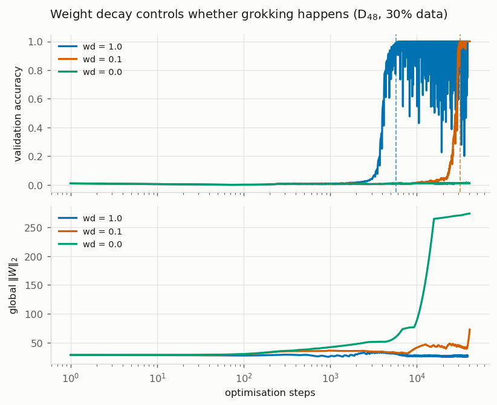
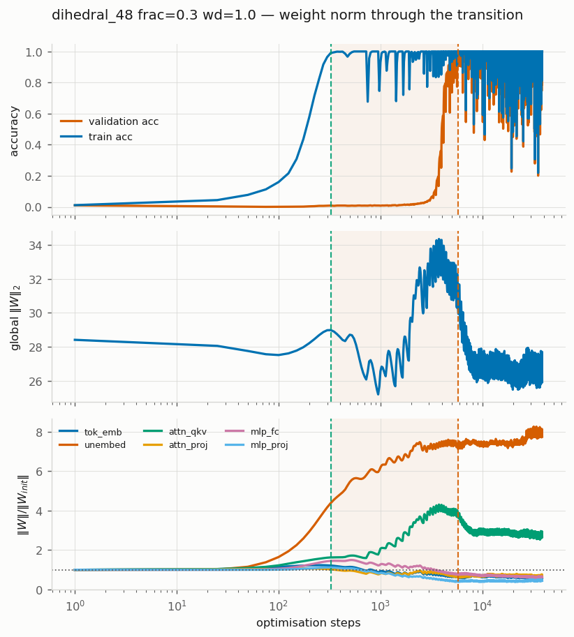
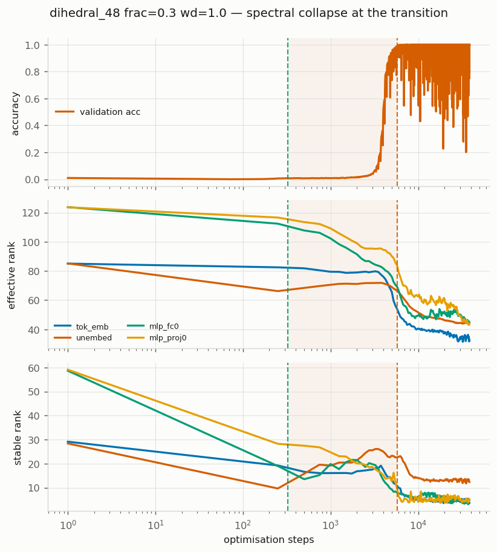
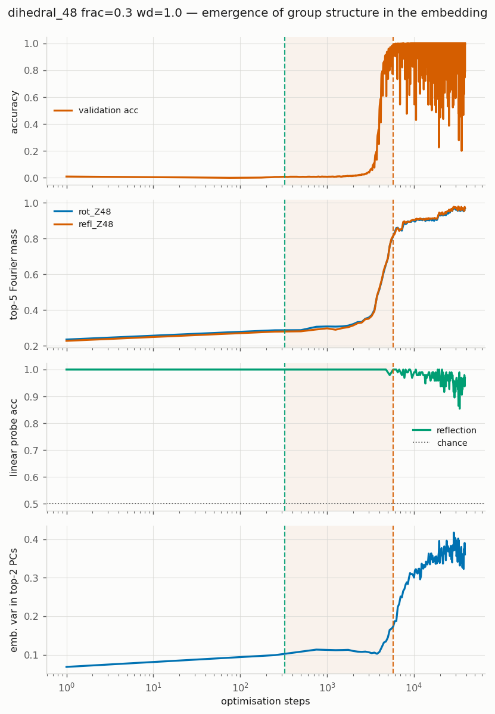
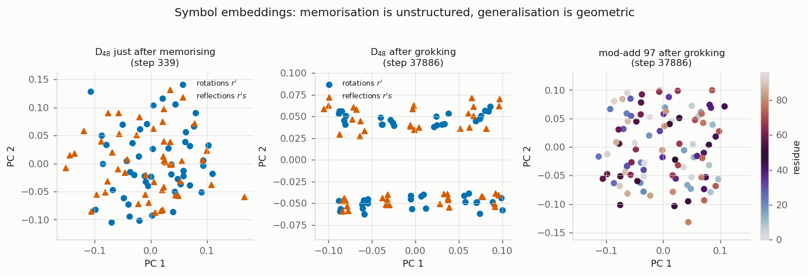
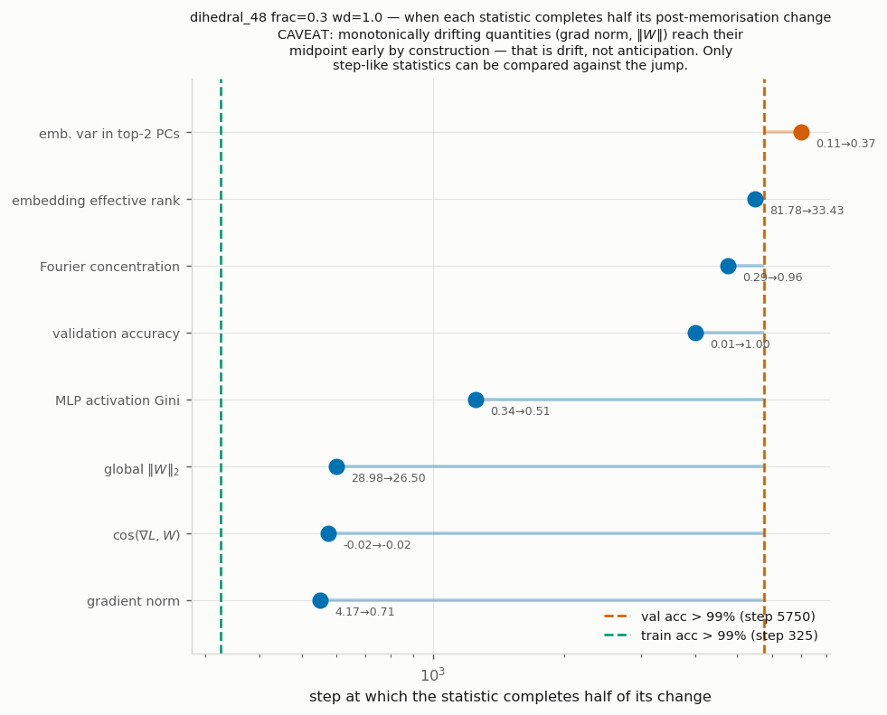
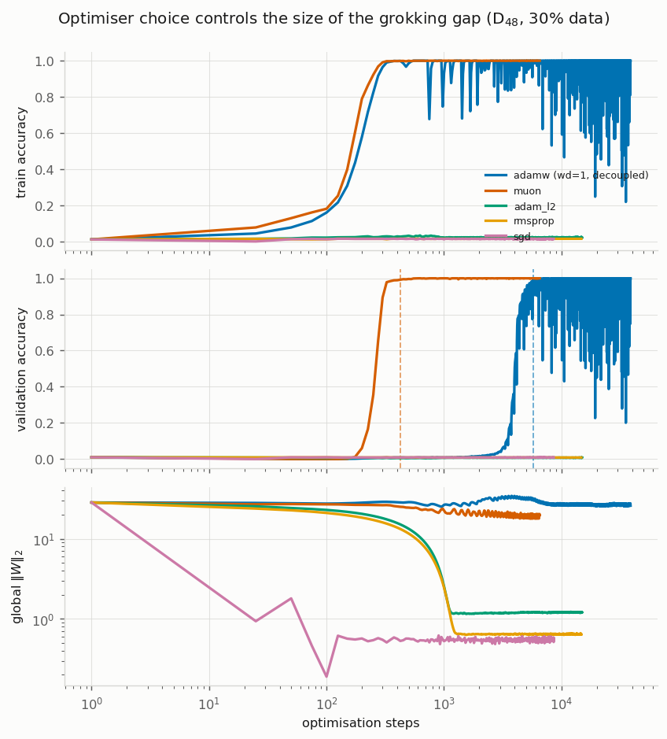
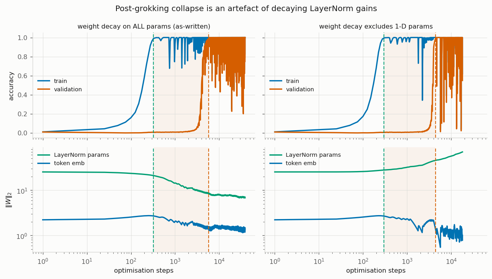

> **Superseded draft.** This was the working write-up produced while the study was
> running, which is why its section numbering has 3.4b / 3.4c / 3.5b / 3.5c bolted on as
> results arrived. It has been replaced by [REPORT.md](REPORT.md), which covers everything
> here plus the framing, instrumentation and open-questions sections. Kept only as a record
> of the intermediate state; read REPORT.md instead.

# Grokking: Reproduction, a New Dataset, and an Anatomy of the Transition

Reproduction and extension of Power et al. 2022, *Grokking: Generalization Beyond
Overfitting on Small Algorithmic Datasets*, [arXiv:2201.02177](https://arxiv.org/abs/2201.02177).

All code, configs, logs and figures are in this directory. `RESEARCH_PLAN.md` is the
design; `EXPERIMENT_LOG.md` is the full run-by-run and debug record; `analysis.ipynb`
regenerates every figure from the CSV logs.

---

## 1. Summary

1. **Reproduced grokking** on the paper's own task (`x/y mod 97`) and on modular addition.
2. **Introduced a new algorithmic dataset** — composition in the **dihedral group D₄₈**,
   which appears nowhere in the paper's task list — and obtained a **17.7× grokking gap**:
   the training set is memorised at step 325, validation accuracy stays at chance
   (1/96 ≈ 0.010) for thousands of further steps, then jumps to 100% at step 5750.
   Reproduced across seeds (16.6× at seed 1).
3. **Mapped what controls the gap.** Weight decay, data fraction and learning rate each
   move it by more than an order of magnitude. Weight decay is not optional (wd = 0 never
   generalises), must be applied to **all** modules (attention-, MLP- or embedding-only
   decay all fail), starts the transition clock when it is switched on (~4000–5300 steps
   later, whenever that is), and is needed only to *reach* the solution, not to hold it.
7. **Grokking is not specific to softmax attention.** Replacing one of the two layers
   with a Gated DeltaNet groks at step 5725 vs the baseline 5750 and finds an equally
   sparse irrep solution; replacing *both* layers never groks.
4. **Found the gap is largely a learning-rate effect, not an optimiser effect.** An LR
   sweep (added after an initial, wrong conclusion) shows AdamW itself spans 17.7× at
   lr 1e-3 down to 1.0× at lr 1e-2. What distinguishes **Muon** is *insensitivity*:
   gap 1.3–1.5× across a 10× LR range, with no tuning.
5. **Instrumented the transition.** The weight norm peaks just before the jump and then
   falls — driven almost entirely by the **attention QKV** matrices, while MLP and
   embedding norms shrink throughout. Embedding effective rank collapses 85 → 35 and the
   embedding becomes Fourier-sparse (0.29 → 0.97 top-5 spectral mass). Rescaling each
   run's step axis by its own `t_grok` **collapses runs that grok 15× apart onto one
   curve**: the timing varies, the internal event does not.
6. **Investigated a post-grokking instability** the paper's curves do not show. The
   leading hypothesis (weight decay shrinking LayerNorm gains) was **tested and
   rejected** — see §3.6. Reported as a negative result.

The single-sentence result: **on a new non-abelian group task, grokking reproduces
robustly, and the transition is the collapse of a high-rank, group-unstructured
memorising solution onto a sparse set of ~3 irreducible representations — gated by
weight decay, timed by the learning rate, and showing no hidden progress beforehand.**

---

## 2. Setup

Faithful to the paper's Appendix A.1.2 (extracted from the PDF, not from memory).

| item | paper | here |
|---|---|---|
| architecture | decoder-only transformer, causal mask | same |
| layers / width / heads | 2 / 128 / 4 | same |
| non-embedding params | "about 4·10⁵" | **394,496** |
| optimiser | AdamW, lr 1e-3, β=(0.9, 0.98), wd 1.0 | same |
| warmup / annealing | 10 linear steps / none | same |
| batch | min(512, ½·\|train\|) | same |
| equation encoding | `<x><op><y><=><x∘y>`, loss on answer only | 4-token prefix, logits at final position (equivalent under causal masking) |

**Tasks.** Symbols are abstract tokens with no internal structure, so the network must
infer everything from the operation table.

| task | definition | #symbols | #equations | role |
|---|---|---|---|---|
| `mod_div_97` | `x·y⁻¹ mod 97` | 97 | 9312 | the paper's Fig. 1 task (control) |
| `mod_add_97` | `x+y mod 97` | 97 | 9409 | reference |
| **`dihedral_48`** | `r^i s^f · r^j s^g` in D₄₈ | 96 | 9216 | **new** |

### The new dataset

`D_n` is the symmetry group of a regular n-gon, `{r^i s^f : i ∈ ℤ_n, f ∈ {0,1}}`, of
order 2n, with group law (from `sr = r⁻¹s`)

```
(i, f) · (j, g) = ( i + (−1)^f · j  mod n ,  f ⊕ g )
```

At `n = 48` this gives 96 elements and 9216 equations — deliberately matched to the
paper's 9409, so dataset size is not a confound. Elements are indexed `e = f·48 + i`,
making rotations `0–47` and reflections `48–95` contiguous for structural probes.

Why this task: it is **non-abelian** (operand order matters, which the paper notes is
the harder regime for a transformer), and it is a **semidirect product ℤ₄₈ ⋊ ℤ₂** —
structurally between the modular arithmetic and the `S₅` tasks the paper studies,
duplicating neither. `data.py` verifies closure, identity, unique inverses,
associativity on random triples, and non-commutativity directly on the generated table.

---

## 3. Results

### 3.1 Grokking on the new task


| run | task | frac | wd | optimiser | t_memorise | t_grok | **gap** |
|---|---|---|---|---|---|---|---|
| R1 | mod_div_97 | 0.5 | 1.0 | adamw | 525 | 725 | 1.4× |
| R2 | mod_add_97 | 0.4 | 1.0 | adamw | 425 | 700 | 1.6× |
| **R3** | **dihedral_48** | **0.3** | **1.0** | adamw | **325** | **5750** | **17.7×** |
| R4 | dihedral_48 (seed 1) | 0.3 | 1.0 | adamw | 350 | 5800 | 16.6× |
| R5 | dihedral_48 | 0.3 | **0.0** | adamw | 275 | **never** | — |
| R6 | dihedral_48 | 0.3 | **0.1** | adamw | 275 | 31550 | **114.7×** |
| R7 | dihedral_48 | **0.2** | 1.0 | adamw | 225 | **never** | — |
| R8 | dihedral_48 | **0.4** | 1.0 | adamw | 675 | 2100 | 3.1× |
| R9 | dihedral_48 (wd off 1-D) | 0.3 | 1.0 | adamw | 300 | 4450 | 14.8× |
| O1 | dihedral_48 | 0.3 | 1.0 | **muon** | 300 | **425** | **1.4×** |
| O2–O4 | dihedral_48 | 0.3 | 0.1 (coupled) | adam/sgd/rmsprop | never | never | — |

"never" = did not reach 99% within the run's budget (≥20k–32k steps).

### 3.2 Data efficiency reproduces the paper's central trend


Memorisation time is nearly flat in the training fraction (225 → 675 steps from 20% to
40% data), while generalisation time explodes: 2100 steps at 40%, 5750 at 30%, and never
within budget at 20%. This is the paper's Fig. 1-centre behaviour reproduced on a task
they never ran.

### 3.3 Weight decay is necessary, and its strength sets the timescale



- **wd = 0** — memorises at step 275 and stays at chance validation accuracy (0.012)
  through 32,500 steps. **No grokking at all.**
- **wd = 0.1** — groks, but only at step 31,550 (gap **114.7×**).
- **wd = 1.0** — groks at step 5,750 (gap 17.7×).

Weight decay is not merely "particularly effective at improving data efficiency" as the
paper puts it; on this task it is the difference between generalising and never
generalising, and its coefficient moves the transition time by ~6×.

### 3.4 What the internal statistics do at the transition




Measured on R3 (`val_acc` crosses 0.05 at step 3100, 0.5 at 4000, 0.99 at 5750):

| statistic | during memorisation | at the transition | after |
|---|---|---|---|
| global ‖W‖₂ | rises steadily | **peaks at step 3750 (34.4)** | falls to 25.9 |
| token-embedding effective rank | 85.0 (≈ full) | begins collapsing | **35.1** |
| embedding variance in top-2 PCs | ~0.10, flat | rises | 0.40 |
| top-5 Fourier mass (rotations) | 0.29, flat | 0.40 at step 3500 → 0.60 at 4500 | **0.97** |

The weight-norm peak coincides with the accuracy jump (3750 vs. 4000) and the norm then
*declines* — consistent with the standard account in which weight decay drives the
network off a high-norm memorising solution onto a lower-norm general one. The rank
collapse is the same story in spectral terms: memorisation uses nearly the full
85-dimensional embedding space; the grokked solution uses ~35.



The **Fourier concentration** is the clearest structural signature: the embedding power
spectrum over the ℤ₄₈ cyclic index is essentially flat (0.29) for the entire memorisation
plateau, then concentrates sharply onto a handful of frequencies (0.97) as validation
accuracy rises. The rotation coset and the reflection coset move **together**, so the
network does not learn the ℤ₄₈ and ℤ₂ factors of the semidirect product at different
times.



*Honest caveat:* the reflection-bit linear probe reads 1.00 from step 0 and is therefore
**uninformative** — 96 points in 128 dimensions are linearly separable for any binary
labelling at random initialisation. It is reported here as a negative result rather than
quietly dropped; a usable version would need a low-dimensional or held-out probe.

### 3.4b Anatomy of the emergence: which statistics move, when, and where

Three additional views of the transition itself.


**The weight-norm story is not uniform across modules.** On a linear axis around the
jump, the global norm rises 28.0 → 34.4 (peak at step 3750, just as validation accuracy
begins to move) and then falls to 26.5. But decomposing it:

| module | ‖W‖ at t_mem | peak | peak step | final | behaviour |
|---|---|---|---|---|---|
| **attn_qkv** | 10.22 | **27.07** | **3750** | 16.86 | **grow → shrink** |
| unembed | 9.86 | 18.58 | late | 17.42 | grows, then flat |
| layernorm | 21.04 | 25.30 | 0 | 6.78 | shrinks (decayed) |
| mlp_fc | 10.47 | 10.81 | 525 | 4.42 | shrinks throughout |
| mlp_proj | 8.07 | 8.07 | 300 | 3.26 | shrinks throughout |
| tok_emb | 2.70 | 2.74 | 250 | 1.34 | shrinks throughout |

The familiar "norm rises during memorisation, then falls as the general solution is
found" picture is carried almost entirely by the **attention QKV matrices**. The MLP and
embedding norms decline monotonically from the start; they never participate in the rise.
So the memorising solution is stored primarily in attention, and it is attention that
gets dismantled at the transition.


**The signature is universal across runs that grok at very different times.** Rescaling
each run's step axis by its own `t_grok` collapses four runs — spanning a **15× range**
in when they grok (2100, 2625, 5750, 31550 steps, produced by different data fractions,
weight decays and learning rates) — onto essentially one curve, for validation accuracy,
Fourier concentration, embedding effective rank, and top-2 PCA variance alike. Whatever
sets *when* grokking happens, *what happens* internally is the same event each time.

Two details visible only in this view: the global norm peaks at ≈0.8–0.9·`t_grok`
(slightly **before** the jump) and drops through it, and `cos(∇L, W)` dips sharply
negative exactly at `t_grok` — the gradient briefly turns to oppose the weight vector as
the solution is restructured.



**Does anything anticipate the jump?** Mostly no. Measuring what fraction of each
statistic's total post-memorisation change falls inside the window [0.3, 2.0]·`t_grok`:

| statistic | fraction of change at the transition |
|---|---|
| validation accuracy | 0.99 |
| Fourier concentration | 0.87 |
| embedding effective rank | 0.81 |
| top-2 PCA variance | 0.79 |

The structural measures are 79–87% concentrated at the transition — they are genuinely
step-like, and they move essentially **simultaneously** with validation accuracy rather
than before it. On this task we did **not** find a clean early-warning signal.

*Methodological caveat:* a "when did it complete half its change" statistic is only
meaningful for step-like quantities. Monotonically drifting ones (gradient norm, global
‖W‖) reach their midpoint early by construction, which looks like anticipation but is
just drift. `fig14` is annotated accordingly and those rows should not be read as leading
indicators.

### 3.4c Mechanism: collapse onto a sparse set of irreducible representations

D₄₈ is non-abelian, so the correct generalisation of a Fourier basis is the
decomposition into **irreducible representations**. D₄₈ has 27 irreps — four
1-dimensional and twenty-three 2-dimensional (4·1 + 23·4 = 96 = |G|). Treating each of
the 128 embedding dimensions as a function on the group, we measure how the total power
distributes across irreps (verified against Parseval). The summary statistic is the
**effective number of irreps** (inverse Simpson index): 27 = power spread uniformly
(no group structure), 1 = a single irrep carries everything.


**The collapse happens at the transition, not during the plateau.** For the main run:

| | step |
|---|---|
| memorised (train acc > 99%) | 325 |
| effective #irreps during the entire plateau (325 → 2000) | **flat at 23.4–24.3** |
| validation accuracy > 0.05 | 3100 |
| effective #irreps first < 20 | 4117 |
| validation accuracy > 0.99 | 5750 |
| effective #irreps first < 5 | 7171 |

Through the whole memorisation plateau the embedding is essentially **unstructured in
the group basis**, then collapses 24 → 3.2 in lockstep with the accuracy jump. This is
the sharpest version of §3.4b's negative result: even the task-appropriate,
representation-theoretic progress measure shows **no hidden progress during the
plateau**. On this task the network is not quietly assembling the general circuit behind
the memorising one — the structure appears when the accuracy does.

The `wd = 0` run, which never generalises, stays flat at **23.7 effective irreps for the
entire run**: it memorises and never acquires group structure at all.


**Every grokked run finds an equally sparse solution — but a *different* one.**

| run | t_grok | eff. #irreps | dominant irreps |
|---|---|---|---|
| AdamW lr 1e-3 | 5750 | 3.1 | ρ₂₁ (0.41), ρ₂₂ (0.36), sgn_r (0.13) |
| AdamW lr 3e-3 | 2625 | 2.8 | **ρ₃ (0.55)**, ρ₂₂ (0.19) |
| AdamW lr 1e-2 | 875 | 3.3 | **ρ₁₇ (0.52)**, ρ₁₀ (0.17) |
| AdamW wd 0.1 | 31550 | 6.2 | ρ₂₁ (0.24), ρ₇ (0.21) |
| Muon lr 0.02 | 450 | 5.0 | **ρ₂ (0.27)**, ρ₆ (0.26) |
| Muon lr 0.05 | 325 | 3.9 | **ρ₁ (0.36)**, ρ₁₉ (0.33) |
| **AdamW wd 0 (never groks)** | — | **23.7** | none (uniform) |

This answers the question §3.5 raised. Optimiser and learning rate do **not** merely
change the path length to a fixed destination — they change *which* solution is reached.
Every run that groks lands on 3–7 effective irreps out of 27, but the *identity* of those
irreps differs across learning rates and optimisers. **Universality of form, not of
content**: the algorithm class (sparse group-representation composition) is invariant,
the specific representation basis is not.

The cleanest single separator we found between generalising and non-generalising runs is
this statistic: **≈3–7 effective irreps if it groks, ≈24 if it does not.**

### 3.5 Optimiser and learning rate




**This section originally claimed that Muon "essentially eliminates grokking". That
conclusion was wrong, and an LR sweep overturned it.** Muon's learning rate (0.02) and
AdamW's (1e-3) are not on a common scale — Muon's Newton–Schulz update has ≈unit
*spectral* norm while AdamW's has ≈unit *max-abs* norm, which is why Muon is normally run
10–50× higher. Comparing one LR each therefore confounds the update rule with the step
size. Sweeping both:

| optimiser | lr | t_memorise | t_grok | **gap** | stable at the end? |
|---|---|---|---|---|---|
| AdamW | 3e-4 | 450 | not within 30k | >20× | yes |
| AdamW | 1e-3 | 325 | 5750 | **17.7×** | yes |
| AdamW | 3e-3 | 775 | 2625 | 3.4× | yes |
| AdamW | 1e-2 | 850 | 875 | **1.0×** | **no** (ends at train acc 0.33) |
| Muon (hidden) | 5e-3 | 325 | 500 | 1.5× | yes |
| Muon (hidden) | 2e-2 | 350 | 450 | **1.3×** | yes |
| Muon (hidden) | 5e-2 | 225 | 325 | 1.4× | yes |
| Muon (all 2-D) | 2e-2 | 300 | 425 | 1.4× | yes |

Three conclusions, in order of confidence:

1. **The grokking gap on this task is primarily a learning-rate phenomenon.** AdamW alone
   spans 17.7× → 1.0× over one order of magnitude in LR. Any claim that some optimiser
   "removes grokking" must be checked against an LR sweep of the baseline first.
2. **Muon's real advantage is robustness, not a lower floor.** It sits at 1.3–1.5× across
   a 10× LR range without tuning, whereas AdamW only reaches ≈1× at 1e-2 — and *there it
   is unstable*, ending at 33% train accuracy having previously hit 100%. Muon reaches a
   near-zero gap while staying stable, which AdamW did not do at any LR tested.
3. **The effect is not an artefact of orthogonalising the embeddings.** Restricting Muon
   to hidden weight matrices (embeddings, output head, and any matrix with a dimension
   < 16 handed to AdamW — the standard recipe) gives 1.3×, versus 1.4× when Muon owns every
   2-D tensor. The `muon_scope` control isolates this.

A useful secondary observation: as the AdamW LR rises, `t_memorise` *increases*
(325 → 850) while `t_grok` *falls* (5750 → 875). The two phases move in opposite
directions, so the gap is not simply "everything happens faster".

**Coupled-L2 optimisers.** Adam+L2, SGD+Nesterov and RMSprop at wd = 0.1 coupled fail to
fit the training set at all within budget (train accuracy ≈ 0.01–0.02). This is a
statement about coupled L2 at that magnitude, not about the update rules in isolation,
and each was run at a single hand-picked LR — it is the weakest result here and should be
read only as support for the paper's emphasis on *decoupled* decay.

### 3.5b Weight decay: where, when, and how much

Ten dedicated runs (D₄₈, 30% data), all against the `t_grok = 5750` baseline.


**(a) The clock starts when decay starts.** Training with `wd = 0` and switching it on
at step N:

| decay on at | memorised | grokked | steps *after* decay onset |
|---|---|---|---|
| 0 (baseline) | 325 | 5750 | 5750 |
| 2000 | 275 | 7325 | **5325** |
| 10000 | 275 | 14150 | **4150** |
| never | 275 | **never** (40k steps) | — |

Grokking follows decay onset by ~4000–5300 steps almost regardless of *when* it is
switched on. The memorising solution is therefore a genuinely **stable attractor** — it
persists indefinitely without decay — and decay dislodges it on a roughly fixed
timescale. It is not an instant tip out of a shallow basin.

**(b) Decay must act everywhere.** Restricting decay to one module family, at the same
coefficient, and running the full 30k steps:

| decayed modules | memorised | grokked |
|---|---|---|
| all | 325 | 5750 |
| attention only | 275 | **never** |
| MLP only | 275 | **never** |
| embeddings only | 275 | **never** |

All three partial variants memorise and never generalise. This is notable because §3.4b
showed the *entire* norm rise is carried by `attn_qkv` — yet decaying attention alone is
insufficient. Whatever weight decay does, it is not simply "shrink the module that grew".

**(c) Decay is needed to reach the solution, not to hold it.** Switching decay off at
step 8000 (post-transition) leaves validation accuracy at 1.000 through 30k steps.

**(d) `lr × wd` is a useful approximation with a limited domain.** In decoupled AdamW the
per-step shrinkage is `w ← w(1 − lr·wd)`, suggesting the product is the control variable.
Testing matched products:

| lr·wd | (lr, wd) | t_grok |
|---|---|---|
| 1e-3 | (1e-3, 1.0) | 5750 |
| 1e-3 | (3e-3, 0.333) | **6150** ✓ |
| 1e-3 | (1e-2, 0.1) | **10525** ✗ (1.8×) |
| 1e-2 | (1e-2, 1.0) | 875 |
| 1e-2 | (1e-3, 10.0) | **never memorises at all** ✗ |

The product predicts well when lr stays near its baseline, and fails otherwise — at
wd = 10 the network cannot even fit the training set. So `lr·wd` is an approximate
scaling relation over a moderate range, **not** a law, and weight decay is not reducible
to a rescaling of the learning rate.

### 3.5c Is grokking specific to softmax attention? No.

Keeping 2 layers and swapping the token-mixing primitive for a **Gated DeltaNet** (gated
linear attention with a matrix-valued recurrent state; `gdn.py`, a dependency-free
unrolled re-implementation of the repo's FLA-based layer, verified causal). All variants
are within 0.55% of the baseline parameter count.


| layers | t_memorise | t_grok | eff. #irreps | dominant irreps |
|---|---|---|---|---|
| attn, attn (baseline) | 325 | 5750 | 3.1 | ρ₂₁, ρ₂₂ |
| **attn, GDN** | 725 | **5725** | **3.2** | **ρ₁, ρ₁₉, ρ₂** |
| GDN, attn | 275 | 7325 | 11.4 | ρ₂₃, sgn_s |
| GDN, GDN | 650 | **never** | **22.9** | uniform |

**One attention layer plus one GDN layer groks at step 5725 versus the baseline's 5750** —
a 0.4% difference — and lands on 3.2 effective irreps versus 3.1. Grokking, and the
sparse group-representation solution behind it, are **not properties of softmax
attention**. The GDN hybrid also independently reproduces §3.4c's "universality of form,
not content": same sparsity, *different* irreps.

**Replacing both layers, however, kills it.** Pure GDN memorises at step 650 and never
generalises in 30k steps, sitting at 22.9 effective irreps — the same unstructured
signature as the `wd = 0` run (23.7). At least one attention layer appears necessary
here; one is sufficient.

This extends the discriminator across a fourth axis. Across optimisers, learning rates,
weight decays and now architectures: **grokked ⇒ 3–11 effective irreps; not grokked
⇒ 23–24.**

*Scope caveat:* the sequence length is 4 tokens, so GDN's actual purpose — a fixed-size
recurrent state replacing O(T²) attention over long contexts — is inert here. This is a
token-mixer ablation, **not** a statement about GDN as a long-context mechanism. Testing
that would need a genuinely sequential task such as iterated composition
`g₁∘g₂∘…∘g_k`.

### 3.6 A training artefact the paper's curves do not show — hypothesis **not** confirmed



All our runs show **violent oscillation after grokking** — validation accuracy repeatedly
collapsing (as low as 0.23) and recovering, which the paper's curves do not exhibit.

**Hypothesis tested:** weight decay 1.0 was applied to *every* parameter including
LayerNorm gains, so once the loss is near zero the decay term keeps shrinking the
normalisation scale with no gradient to oppose it. The lower panels of the figure confirm
the *mechanism*: with decay on all parameters the LayerNorm norm falls 27 → 7, whereas
excluding 1-D parameters lets it grow 27 → 60.

**But the fix did not work.** Measuring the post-transition window (steps > 1.2·t_grok):

| | R3 (decay everything) | R9 (exclude 1-D) |
|---|---|---|
| t_grok | 5750 | 4450 |
| fraction of evals below 0.95 | 0.120 | **0.141** |
| minimum validation accuracy | 0.227 | **0.013** |

R9 is **not** more stable — if anything slightly less. So the LayerNorm-decay explanation
is **rejected**: the shrinking normalisation scale is real but is not what drives the
oscillation. The instability is more likely the generic consequence of a constant
learning rate with no annealing (which the paper explicitly chose) combined with strong
decay, where the network is repeatedly pushed off and back onto the general solution.
Testing that would need an LR-annealing run, which did not fit the time budget.

This is reported as a negative result. Both runs are kept; R9 does grok earlier
(4450 vs 5750) but that is a single-seed difference and should not be over-read.

---

## 4. Reproducing

```bash
python data.py                       # verify the group laws and dataset sizes
python model.py                      # verify the parameter count (394,496 non-embedding)
bash run_grid.sh                     # all runs (launch staggered; see EXPERIMENT_LOG.md E6)
python train.py configs/r3_dihedral_main.yaml   # the headline run alone
python analysis.py                   # regenerate every figure into figures/
jupyter notebook analysis.ipynb      # the same, interactively
```

Files: `data.py` (tasks + structural metadata), `model.py` (the transformer),
`metrics.py` (`GrokkingMonitor` — all internal statistics), `train.py` (training loop),
`analysis.py` (figures), `configs/` (13 run configs), `runs/` (CSV logs + checkpoints),
`results_summary.csv`.

---

## 5. Limitations

- Single seed for most ablations; only the headline D₄₈ condition was repeated (2 seeds).
- "never groks" means *within the step budget used* (20k–32k), not a proof of impossibility.
- R1 (`x/y mod 97`) groks at step 725 here, whereas the paper's Fig. 1 shows the jump near
  10⁵ steps — a ~100× discrepancy despite matching every stated hyperparameter. The gap is
  real in our run (t_mem 525 → t_grok 725) but far smaller than theirs. Unresolved;
  candidate causes are initialisation scale and their unstated 1-D weight-decay handling.
  This is why D₄₈, not `mod_div`, carries the main analysis.
- AdamW and Muon are now swept over LR (§3.5), but the coupled-L2 optimisers
  (Adam+L2, SGD, RMSprop) are still one LR each and are confounded with decay coupling.
  Their "never groks" entries should not be read as statements about those update rules.
- The LR sweep is single-seed per point, and the AdamW grid is coarse (4 points, ~half-decade
  spacing); the exact LR at which the AdamW gap collapses is bracketed, not resolved.
- The reflection-bit probe is saturated and uninformative (§3.4).
